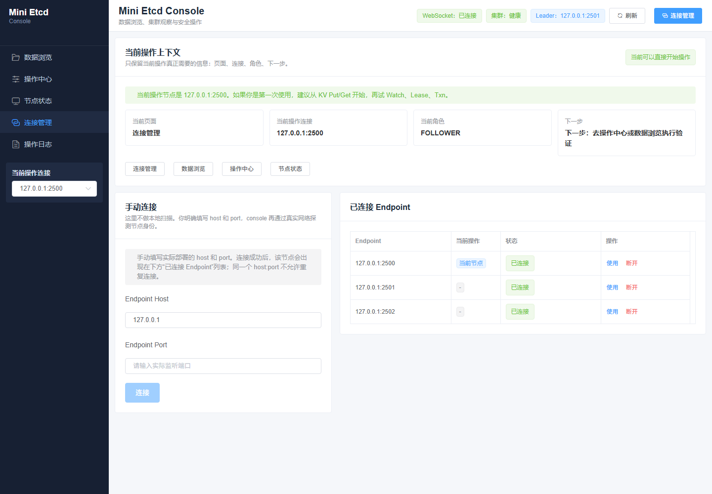
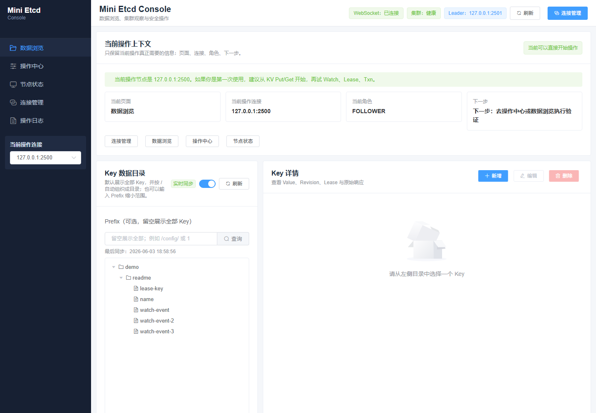
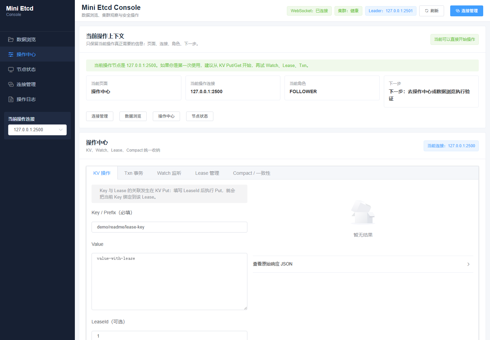
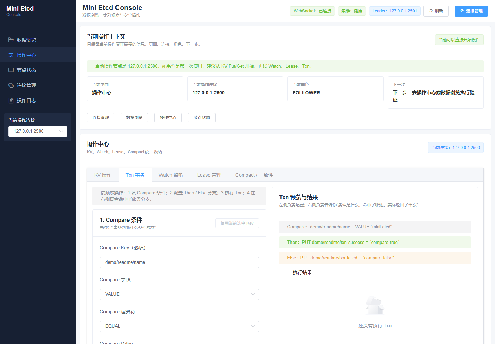
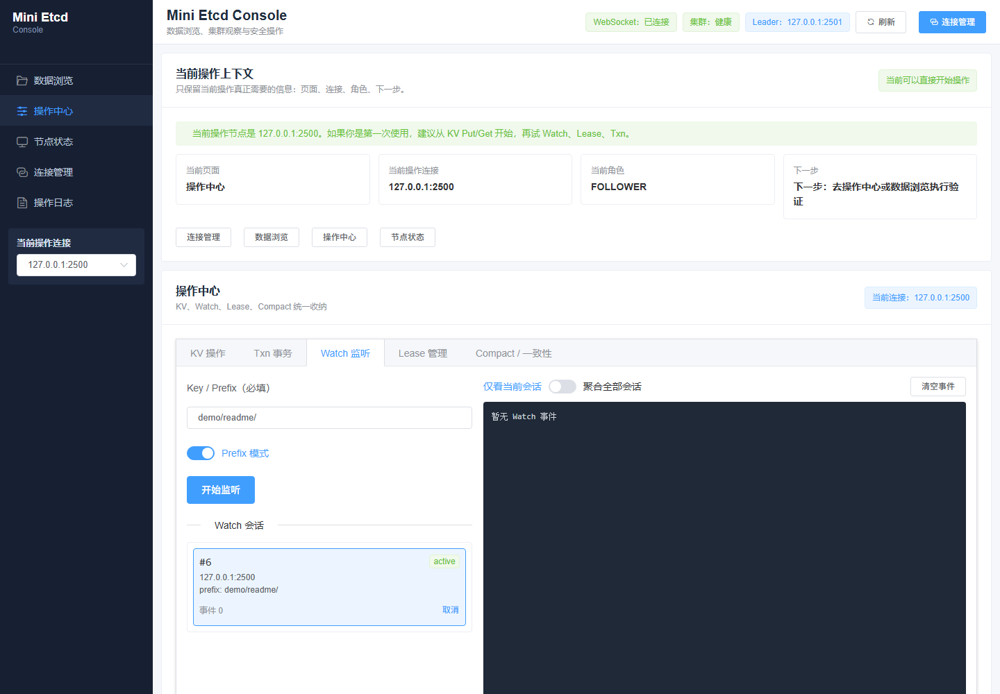
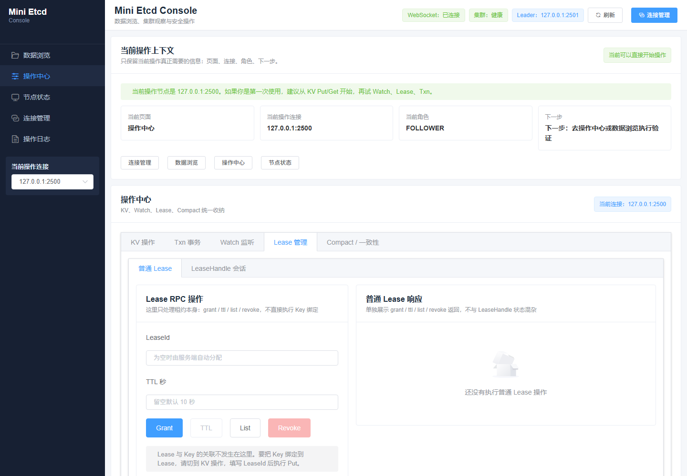
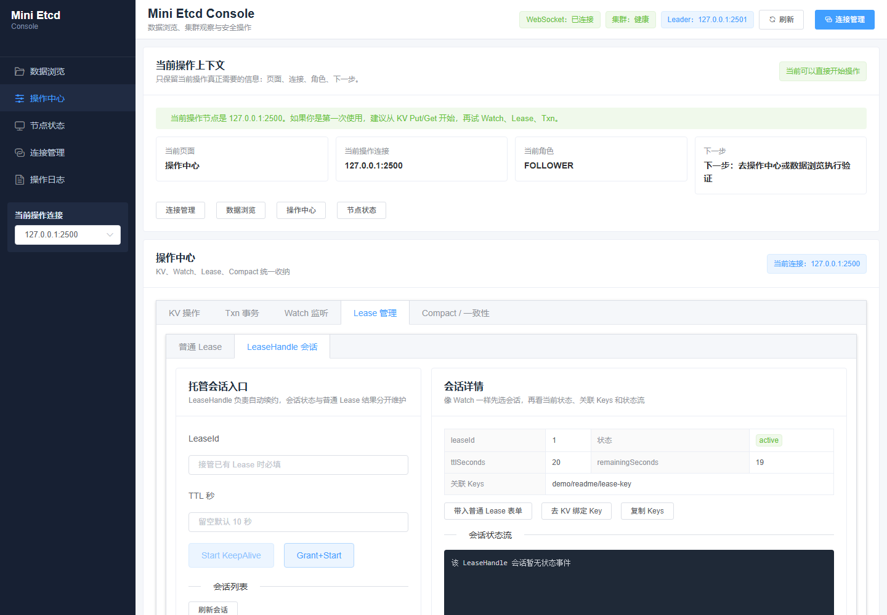
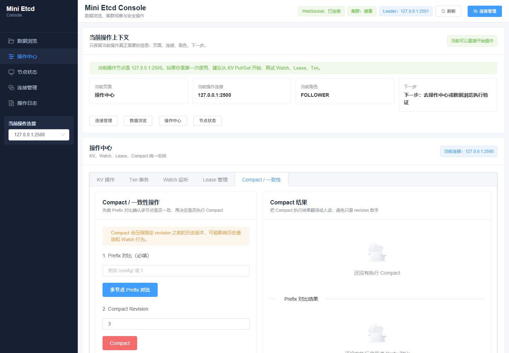
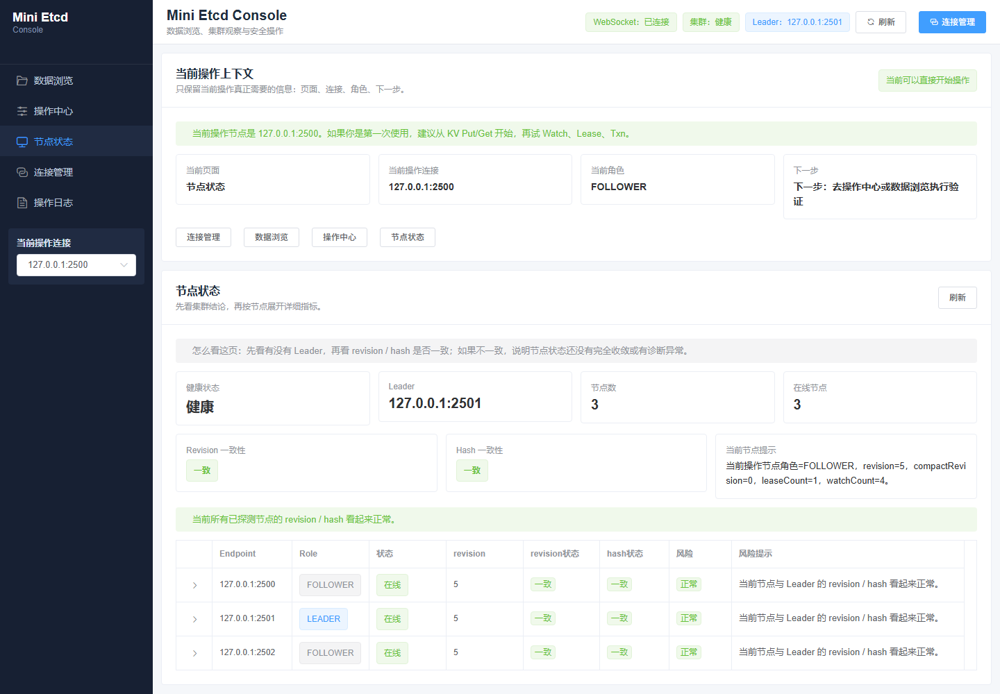

# mini-etcd-project

一个基于 Java 8 的 mini-etcd 学习型项目，按真实网络链路实现了从分布式一致性内核到 SDK、Web Console 的完整调用路径。

本项目适合用于学习 Raft、MVCC KV、Txn、Compact、Lease、Watch、客户端封装与控制台可视化管理之间的职责边界。它不是对 etcd 的生产级替代实现，而是一个尽量保持结构清晰、链路可验证、模块边界明确的教学型工程。

## 目录

- [项目定位](#项目定位)
- [核心能力](#核心能力)
- [整体架构](#整体架构)
- [模块说明](#模块说明)
- [快速开始](#快速开始)
- [Console 使用入口](#console-使用入口)
- [SDK 使用示例](#sdk-使用示例)
- [运行截图](#运行截图)
- [测试与验证](#测试与验证)
- [文档索引](#文档索引)
- [常见问题](#常见问题)
- [项目边界](#项目边界)

## 项目定位

mini-etcd-project 的目标不是堆叠功能数量，而是用一个较小的 Java 工程完整演示 etcd 类系统的核心链路：

- 客户端如何通过 SDK 发起请求。
- 请求如何经过 Netty RPC 到达 etcd 节点。
- 节点如何通过 Raft 复制日志并提交状态机命令。
- 状态机如何维护 MVCC、Txn、Compact、Lease、Watch、Diagnostic 等语义。
- Console 如何通过 REST 与 WebSocket 把后端能力展示成可操作页面。

项目当前更关注可读性和可验证性，适合做如下用途：

- 分布式系统学习与源码阅读。
- Raft 状态机命令链路调试。
- MVCC、Txn、Lease、Watch 等能力的端到端验证。
- Java 8 + Netty + Spring Boot 多模块工程实践。

## 核心能力

### Raft 与运行时

- 支持多节点 mini-etcd 集群启动。
- 支持 Leader 选举、日志复制、提交应用与状态机执行。
- SDK 请求会通过节点运行时链路进入 Raft，再由状态机返回结果。
- 提供脚本化三节点启动，便于用真实端口验证网络链路。

### MVCC KV

- 支持 `put`、`get`、`range`、`delete`、`deleteRange`。
- 支持 revision 版本推进与历史读取边界。
- 支持前缀查询、空结果、删除范围等基础场景。
- 与 Lease、Watch、Compact 共同维护一致的 revision 语义。

### Txn

- 支持 compare + success/failure 分支执行。
- 支持按 key、revision、value 等条件判断事务分支。
- Txn 请求和响应模型复用 RPC 层模型，减少 Console、SDK、RPC 之间的心智差异。
- Console 提供分步骤事务构造与结果展示，便于观察 compare 命中和分支执行结果。

### Compact

- 支持按 revision 进行历史版本压缩。
- 支持旧 revision 访问边界提示。
- Watch 与历史读取会根据 compact 边界返回可读错误。

### Lease

- 普通 Lease RPC：`grant`、`ttl`、`list`、`revoke`。
- KV 写入支持绑定 leaseId。
- Lease 到期或撤销后，关联 key 会按租约关系删除。
- LeaseHandle 支持托管型自动续约会话，包含启动、续约中、关闭等生命周期状态。

### Watch

- 服务端分配 watchId。
- 支持 watch 创建、取消、多 watch 并发。
- 支持通过 WebSocket 推送事件到 Console。
- Console 按 watch 会话分视图展示事件，避免多个 watch 事件混在一个总列表中。

### Diagnostic

- 支持节点状态诊断。
- 支持状态 hash 等一致性辅助观察能力。
- Console 提供节点级诊断入口，用于确认当前连接、节点状态与 KV 状态摘要。

### SDK

- `EtcdClient` 是对外调用入口。
- `WatchHandle` 管理 watch 会话生命周期。
- `LeaseHandle` 管理自动续约租约会话生命周期。
- SDK 封装屏蔽 RPC 细节，但保留关键资源关闭语义。

### Console

- Spring Boot 后端提供 REST API 和 WebSocket。
- 前端页面覆盖连接管理、KV、Txn、Compact、Lease、Watch、Diagnostic。
- Watch 与 LeaseHandle 均按会话维度展示，便于观察生命周期和事件流。

## 整体架构

```mermaid
flowchart LR
    Browser["Browser / Console UI"]
    RestWs["Console REST + WebSocket"]
    Sdk["etcd-sdk / EtcdClient"]
    Rpc["etcd-rpc / Netty RPC"]
    Node["etcd-kernel / EtcdNode"]
    Raft["RaftNode"]
    StateMachine["State Machine"]
    Store["MVCC KV / Lease / Watch / Txn / Compact / Diagnostic"]
    Storage["etcd-storage"]

    Browser --> RestWs
    RestWs --> Sdk
    Sdk --> Rpc
    Rpc --> Node
    Node --> Raft
    Raft --> StateMachine
    StateMachine --> Store
    Store --> Storage
    Store -- watch and lease events --> RestWs
    RestWs -- WebSocket push --> Browser
```



一次典型 KV 写入链路如下：

```text
Console UI
  -> Console REST Controller
  -> Console Service
  -> EtcdClient
  -> Netty RPC
  -> EtcdNode
  -> RaftNode append/commit
  -> KeyValueStore apply
  -> Watch/Lease side effects
  -> HTTP response + WebSocket event
```

## 模块说明

| 模块 | 职责 |
| --- | --- |
| `etcd-serializer` | 序列化抽象与实现，供 RPC 和存储链路复用。 |
| `etcd-storage` | 本地存储、日志或快照相关基础能力。 |
| `etcd-rpc` | Netty RPC 通信层，请求、响应、流式消息分发。 |
| `etcd-kernel` | mini-etcd 内核，包含 Raft、MVCC KV、Txn、Compact、Lease、Watch、Diagnostic。 |
| `etcd-sdk` | Java SDK，对外暴露 `EtcdClient`、`WatchHandle`、`LeaseHandle`。 |
| `etcd-console` | Web Console，包含 Spring Boot 后端、REST API、WebSocket 与前端页面。 |
| `docs` | 架构文档，按功能模块描述实现语义和调用链路。 |

## 快速开始

### 环境要求

- JDK 8+
- Maven 3.6+
- Windows、Linux 或 macOS
- 默认端口：
  - mini-etcd 节点：`2379`、`2380`、`2381`
  - Console：`8080`

如果默认端口被占用，可以通过启动脚本的 `--basePort` 参数切换到其他端口段，例如 `2500`、`2600`。

### 构建项目

在项目根目录执行：

```bash
mvn clean package -DskipTests
```

只编译 Console 及其依赖：

```bash
mvn -pl etcd-console -am clean package -DskipTests
```

### 启动三节点集群（Windows）

进入 Console 脚本目录：

```bat
cd etcd-console/scripts
```

使用默认 profile 和默认端口启动：

```bat
start-cluster.cmd
```

使用独立 profile 和自定义端口启动：

```bat
start-cluster.cmd --profile=demo --clusterSize=3 --basePort=2500
```

脚本会在启动前检查端口占用。如果集群端口已经被其他进程占用，脚本会打印被占用端口、PID、进程命令和处理建议，并在启动节点前终止。

### 启动三节点集群（Linux / macOS）

进入 Console 脚本目录：

```bash
cd etcd-console/scripts
chmod +x start-cluster.sh clean-runtime.sh
```

启动默认三节点集群：

```bash
./start-cluster.sh
```

启动自定义 profile：

```bash
./start-cluster.sh --profile=demo --clusterSize=3 --basePort=2500
```

### 启动 Console

如果使用命令行启动：

```bash
mvn -pl etcd-console -am -DskipTests install
mvn -f etcd-console/pom.xml org.springframework.boot:spring-boot-maven-plugin:2.7.18:run
```

如果使用 IDEA 启动，请直接运行 `etcd-console` 模块中的 Spring Boot 启动类。

启动成功后访问：

```text
http://127.0.0.1:8080/
```

### 清理运行时数据

清理默认 profile：

```bat
cd etcd-console/scripts
clean-runtime.cmd
```

清理指定 profile：

```bat
clean-runtime.cmd --profile=demo
```

Linux / macOS：

```bash
cd etcd-console/scripts
./clean-runtime.sh --profile=demo
```

## Console 使用入口

Console 是本项目最适合演示端到端链路的入口。推荐按如下顺序体验：

1. 连接管理

打开 Console 后，先在连接管理页手动输入节点地址，例如：

```text
127.0.0.1:2379
127.0.0.1:2380
127.0.0.1:2381
```

连接成功后，页面会显示当前连接目标。后续 KV、Txn、Lease、Watch、Diagnostic 操作都会作用于当前连接背后的 mini-etcd 集群。

2. KV

先写入一个普通 key：

```text
key: demo/name
value: mini-etcd
```

再执行 `get`、`range`、`delete`、`deleteRange`，观察 revision、返回 key/value 和空结果提示。

3. Watch

创建一个 watch 会话，例如监听：

```text
key: demo/
prefix: true
```

然后回到 KV 页面写入 `demo/a`、`demo/b`。Watch 页面会按会话展示事件，取消某个 watch 后，该会话不应继续接收新事件。

4. Lease

普通 Lease 操作适合观察一次性 RPC 行为：

```text
grant -> ttl -> list -> revoke
```

KV 绑定租约应在 KV 页面完成，因为绑定动作本质是一次带 leaseId 的 KV put。Lease 页面负责展示租约创建、查询、撤销以及 LeaseHandle 托管会话状态。

5. LeaseHandle

LeaseHandle 是托管型自动续约会话。推荐体验：

```text
grant + start -> 观察续约中 -> close/stop -> 观察状态关闭
```

LeaseHandle 会话和普通 Lease RPC 结果分开展示，避免把“一次性操作结果”和“持续生命周期状态”混在一起。

6. Txn

推荐先用 KV 写入一个 compare 目标 key，再到 Txn 页面构造：

```text
compare: key == value
success branch: put txn/result success
failure branch: put txn/result failed
```

执行后查看 compare 是否命中、实际执行了哪个分支，以及分支操作结果。

7. Compact

在产生多个 revision 后执行 compact。随后尝试读取或 watch 已经被压缩的旧 revision，观察边界错误提示。

8. Diagnostic

进入诊断页查看节点状态、hash 等信息。该页面适合确认当前集群是否运行、当前连接是否可用、多个节点状态是否一致。

## SDK 使用示例

以下示例展示 SDK 的典型调用方式。具体类名和参数以当前源码为准。

```java
import com.xhj.etcd.kernel.etcd.etcdrpc.GetRequest;
import com.xhj.etcd.kernel.etcd.etcdrpc.LeaseGrantRequest;
import com.xhj.etcd.kernel.etcd.etcdrpc.PutRequest;
import com.xhj.etcd.kernel.etcd.etcdrpc.WatchCancelResponse;
import com.xhj.etcd.kernel.etcd.etcdrpc.WatchNotification;
import com.xhj.etcd.kernel.etcd.etcdrpc.WatchSubscribeRequest;
import com.xhj.etcd.kernel.etcd.etcdrpc.WatchSubscribeResponse;
import com.xhj.etcd.rpc.NodeEndpoint;
import com.xhj.etcd.sdk.client.EtcdClient;
import com.xhj.etcd.sdk.client.lease.LeaseHandle;
import com.xhj.etcd.sdk.client.watch.WatchHandle;
import com.xhj.etcd.sdk.client.watch.WatchListener;

import java.util.Arrays;

public class MiniEtcdDemo {

    public static void main(String[] args) {
        EtcdClient client = new EtcdClient(Arrays.asList(
                new NodeEndpoint("n1", "127.0.0.1", 2379),
                new NodeEndpoint("n2", "127.0.0.1", 2380),
                new NodeEndpoint("n3", "127.0.0.1", 2381)
        ));

        try {
            client.put(new PutRequest("demo/name", "mini-etcd"));
            System.out.println(client.get(new GetRequest("demo/name")));

            WatchSubscribeRequest watchRequest = new WatchSubscribeRequest();
            watchRequest.setStartKey("demo/");
            watchRequest.setPrefixMatch(true);
            watchRequest.setStartRevision(0L);
            watchRequest.setMaxEvents(16);

            WatchHandle watchHandle = client.watch(watchRequest, new WatchListener() {
                @Override
                public void onSubscribed(WatchSubscribeResponse response) {
                    System.out.println("watch subscribed: " + response.getWatchId());
                }

                @Override
                public void onNotification(WatchNotification response) {
                    System.out.println("watch event: " + response);
                }

                @Override
                public void onCanceled(WatchCancelResponse response) {
                    System.out.println("watch canceled: " + response.getWatchId());
                }

                @Override
                public void onError(Throwable cause) {
                    cause.printStackTrace();
                }
            });

            LeaseHandle leaseHandle = client.grantAndStartLeaseKeepAlive(new LeaseGrantRequest(0L, 10L));
            client.put(new PutRequest("demo/lease-key", "value-with-lease", leaseHandle.getLeaseId()));

            client.put(new PutRequest("demo/a", "1"));
            client.put(new PutRequest("demo/b", "2"));

            watchHandle.close();
            leaseHandle.close();
        } finally {
            client.close();
        }
    }
}
```

## 运行截图

建议加入运行时图片，尤其是 Console 类项目。图片可以让第一次打开仓库的人快速理解“这个项目能跑起来，并且能通过页面验证功能”。

截图统一放在：

```text
docs/assets/
```

### 连接管理

展示手动输入节点、三节点连接成功、当前操作连接与 Leader 识别。



### MVCC

MVCC 在 Console 中有两个入口：数据浏览负责观察当前 keyspace，KV 操作负责执行 put/get/range/delete/deleteRange。

数据浏览视图展示 Key 目录按 `/` 组织后的结果，适合作为 KV、Watch、Lease 操作后的观察入口。



KV 操作视图展示 key/value/leaseId 表单，能直接看到 Key 与 Lease 的绑定发生在 KV Put。



### Txn 事务

展示 Txn 的 Compare、Then、Else 三段式配置，右侧同步给出可读的事务预览。



### Watch

展示 Watch 会话单独成组，事件不会混入一个全局列表，便于观察每个 watchId 的生命周期。



### Lease 管理

Lease 在 Console 中拆成两个视图：普通 Lease 是一次性 RPC 操作，LeaseHandle 是托管型自动续约会话。

普通 Lease 视图展示 grant/ttl/list/revoke 响应，避免和自动续约会话状态混在一起。



LeaseHandle 视图展示会话列表、当前状态、ttl/remaining、关联 key 和状态流。



### Compact / 一致性

展示 compact revision 输入和跨节点一致性对比入口，用于观察历史压缩边界和节点状态差异。



### 节点状态

展示三节点状态、Leader、revision/hash 等诊断信息，适合确认集群是否健康。



## 测试与验证

### 单元测试

```bash
mvn test
```

### Console 相关编译验证

```bash
mvn -pl etcd-console -am test
```

### 真实网络链路验证

推荐用三节点集群 + Console 完成全链路验证：

```text
Console 前端操作
  -> Console 后端 REST / WebSocket
  -> etcd-sdk
  -> etcd-rpc
  -> etcd-kernel 节点
  -> Raft 提交
  -> 状态机执行
  -> 响应和事件回传 Console
```

建议覆盖场景：

| 功能 | 验证点 |
| --- | --- |
| 连接管理 | 新增连接、切换连接、断开连接、异常连接提示。 |
| KV | put/get/range/delete/deleteRange、前缀、空结果、错误输入。 |
| Txn | compare 成功、compare 失败、success/failure 分支执行、结果展示。 |
| Compact | compact 请求、旧 revision 边界、错误提示。 |
| Lease | grant、ttl、list、revoke、KV 绑定 leaseId 后撤销删除。 |
| LeaseHandle | grant+start、自动续约、stop/close、状态变化展示。 |
| Watch | 创建、取消、多 watch 并发、事件推送、取消后不再接收。 |
| Diagnostic | status、hash、节点运行态展示。 |

## 文档索引

更详细的实现说明见 `docs` 目录：

- [文档总索引](docs/README.md)
- [运行时链路](docs/architecture-01-runtime.md)
- [MVCC KV](docs/architecture-02-mvcc.md)
- [Txn](docs/architecture-03-txn.md)
- [Compact](docs/architecture-04-compact.md)
- [Lease](docs/architecture-05-lease.md)
- [Watch](docs/architecture-06-watch.md)
- [Diagnostic](docs/architecture-07-diagnostic.md)
- [SDK](docs/architecture-08-sdk.md)
- [Console](docs/architecture-09-console.md)
- [集群启动脚本](docs/architecture-10-cluster-startup.md)

## 常见问题

### 端口被占用怎么办？

默认节点端口是 `2379`、`2380`、`2381`。如果端口被占用，启动脚本会在启动前打印占用端口、PID 和进程命令。

优先建议切换端口段：

```bat
start-cluster.cmd --profile=demo --clusterSize=3 --basePort=2500
```

或者关闭占用进程后再启动。注意 Windows 上 `2379` 有时可能被 VMware NAT 等本机服务占用，不建议脚本自动强杀这类系统或第三方服务。

### Console 连不上节点怎么办？

先确认三件事：

- mini-etcd 节点进程是否已经启动。
- Console 输入的 host 和 port 是否与节点启动端口一致。
- 节点端口是否被其他进程占用。

可以查看脚本运行日志：

```text
etcd-console/scripts/runtime/profiles/<profile>/logs/
```

### Lease 绑定 key 应该在哪里操作？

绑定 leaseId 是 KV 写入语义，因此应在 KV 页面执行带 leaseId 的 `put`。

Lease 页面负责普通 Lease RPC 和 LeaseHandle 会话管理：

- 普通 Lease：`grant`、`ttl`、`list`、`revoke`。
- LeaseHandle：自动续约会话的创建、状态刷新、关闭。

### Watch 为什么没有收到事件？

检查以下条件：

- Watch 会话是否仍处于 active 状态。
- 写入 key 是否匹配 watch key 或 prefix。
- 是否已经取消了对应 watch 会话。
- 是否使用了 compact 之后不可用的旧 revision。

### clean-runtime 会删除什么？

清理脚本只处理脚本运行时目录下的 profile 数据，例如：

```text
etcd-console/scripts/runtime/profiles/<profile>/
```

它不应该清理源码目录，也不应该强杀全局 Java 进程。

## 项目边界

本项目是学习型 mini-etcd 实现，核心目标是解释和验证 etcd 类系统的关键链路。当前不承诺生产级能力：

- 不提供完整 etcd API 兼容性。
- 不提供生产级安全、认证、TLS 与权限模型。
- 不提供生产级运维、监控、高可用故障注入体系。
- 不替代官方 etcd、Apache Ratis、SOFAJRaft 等成熟项目。

如果目标是生产环境分布式 KV，请优先评估官方 etcd 或成熟 Raft 框架；如果目标是学习 Raft + 状态机 + SDK + Console 的完整闭环，本项目更适合作为可读、可运行、可调试的样例工程。
