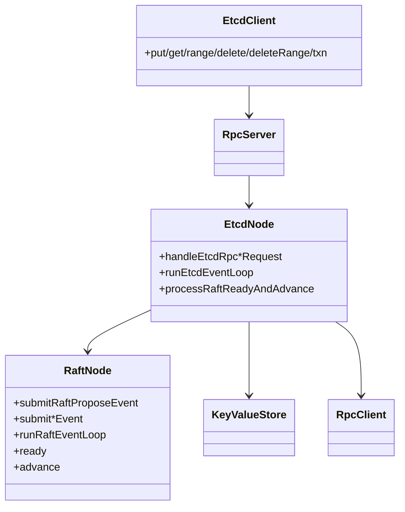
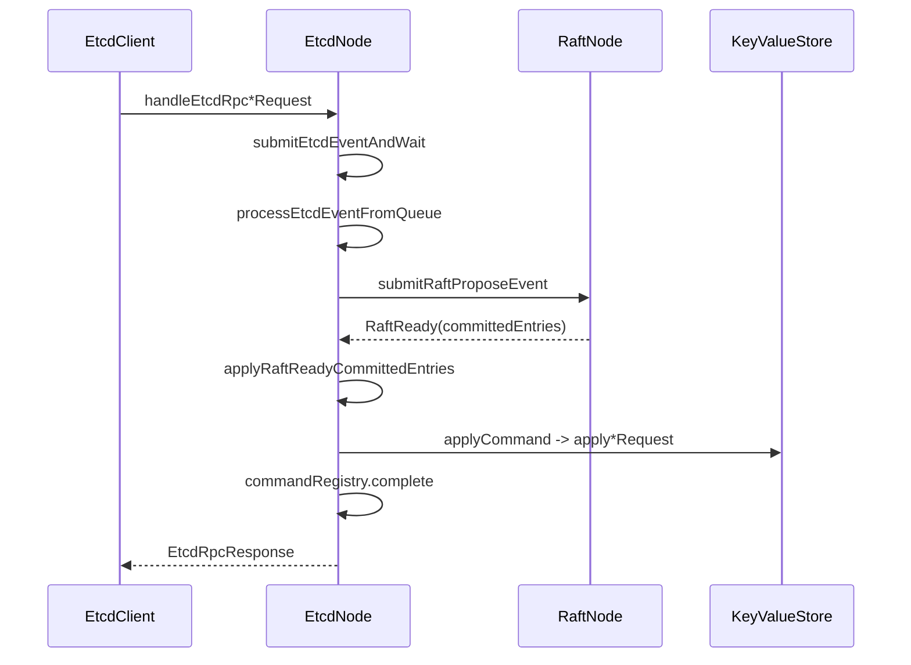
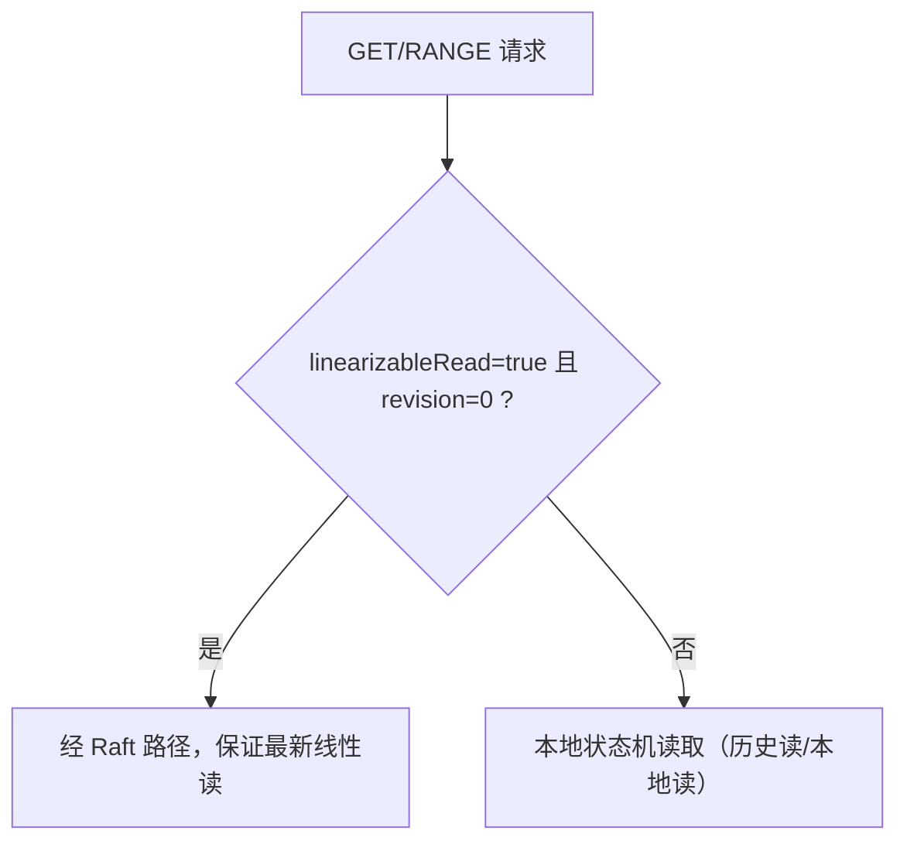
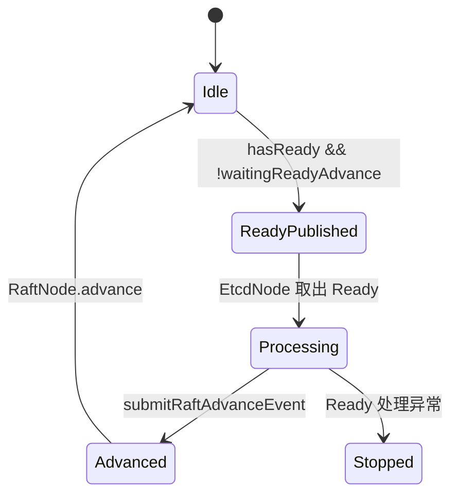

# Etcd/Raft/RPC 运行时架构说明

## 1. 文档范围

本文只解释当前已实现代码中的“真实运行路径”：

1. 客户端请求如何从 RPC 进入，最终变成状态机变更。
2. `etcd-event-loop` 与 `raft-event-loop` 的职责和先后关系。
3. Raft RPC 消息在节点间如何收发。
4. 快照、崩溃恢复、命令回包如何保证一致性。

## 2. 小白先看：一次写请求的最短路径

如果你只想先抓住主线，先看这 8 步：

1. `EtcdClient` 发起写请求（例如 `put`）。
2. `RpcServer` 把请求转给 `EtcdNode.handleEtcdRpcPutRequest`。
3. `EtcdNode` 把请求包装成 `EtcdEvent`，放入 `etcdEventQueue`。
4. `EtcdNode.runEtcdEventLoop` 取出事件，调用 `submitEtcdCommandAsync` 提交到 `RaftNode`。
5. `RaftNode.runRaftEventLoop` 接收 propose，推进协议状态。
6. `RaftNode` 产生 `RaftReady`，交回 `EtcdNode`。
7. `EtcdNode` 按固定顺序处理 `RaftReady`，其中包含 apply committed 日志到 `KeyValueStore`。
8. apply 完成后，`EtcdNode` 通过 `commandRegistry` 唤醒等待中的 RPC 线程并返回响应。

只要把这 8 步理解透，后续读 `mvcc/txn` 文档会顺很多。

## 3. 角色边界

各层只做一件事：

1. `EtcdNode`：业务请求入口、分流、回包协调。
2. `RaftNode`：协议推进（选主、日志复制、提交边界）。
3. `KeyValueStore`：纯状态机读写，不关心网络。
4. `RpcServer/RpcClient`：纯传输层。

## 4. 两个事件循环为什么都需要

## 4.1 `etcd-event-loop`（业务主循环）

主方法链：

1. `start`
2. `runEtcdEventLoop`
3. `processEtcdEventFromQueue`
4. `processGetEvent/processRangeEvent` 或 `submitEtcdCommandFromEvent`
5. `processRaftReadyAndAdvance`

职责：

1. 串行处理业务事件，避免业务状态机并发写入。
2. 串行执行 `RaftReady` 的副作用（持久化、apply、发消息、advance）。

## 4.2 `raft-event-loop`（协议主循环）

主方法链：

1. `startRaftEventLoop`
2. `runRaftEventLoop`
3. `processRaftEvent`
4. `publishRaftReadyIfNeeded`

职责：

1. 串行处理协议事件（`PROPOSE/STEP/TICK/ADVANCE`）。
2. 统一在事件处理后检查 `hasReady()` 并产出 `RaftReady`。

## 4.3 关键约束

1. `RaftNode` 不直接落业务状态机。
2. `EtcdNode` 不直接改 Raft 内核状态，只投递事件。
3. 同时只允许一个“未 Advance 的 Ready”，防止跨批次副作用交错。

## 5. 写请求全链路（PUT/DELETE/DELETE_RANGE/TXN）

精确方法链：

1. `handleEtcdRpcPutRequest`（其他写接口同模式）
2. `submitEtcdEventAndWait`
3. `submitEtcdCommandFromEvent`
4. `submitEtcdCommandAsync`
5. `raftNode.submitRaftProposeEvent`
6. `RaftNode.propose`（在 `raft-event-loop`）
7. `RaftNode.ready` + `publishRaftReadyIfNeeded`
8. `processRaftReadyFromQueue`
9. `applyRaftReadyCommittedEntries`
10. `applyRaftApplyMessage`
11. `applyCommand`
12. `commandRegistry.complete`

## 6. 读请求分流（GET/RANGE）

分流含义：

1. 你要“最新且线性一致”的结果，就走 Raft 路径。
2. 你要“指定历史 revision”或“本地快速读”，就走本地状态机。

## 7. Raft RPC 网络交互

## 7.1 入站：网络消息如何进 Raft

RPC 入口方法：

1. `handleRaftRpcRequestVoteRequest`
2. `handleRaftRpcRequestVoteResponse`
3. `handleRaftRpcAppendEntriesRequest`
4. `handleRaftRpcAppendEntriesResponse`
5. `handleRaftRpcInstallSnapshotRequest`
6. `handleRaftRpcInstallSnapshotResponse`

这些入口只做“事件投递”：

1. `raftNode.submitRequestVote*Event`
2. `raftNode.submitAppendEntries*Event`
3. `raftNode.submitInstallSnapshot*Event`

真正状态推进统一在 `raft-event-loop` 的 `step(...)`。

## 7.2 出站：Raft 消息如何发到远端

1. `RaftNode` 在内部生成待发送消息。
2. `ready().messagesToSend` 暴露到 `RaftReady`。
3. `EtcdNode.sendRaftReadyMessages(ready)` 通过 RPC 发出。

## 7.3 连接关闭范围控制（本次修复点）

过去的边界问题是：客户端某一条 TCP 连接断开时，RPC 客户端分发器会把“连接关闭”事件广播给全部未完成 handler，可能误伤其他连接上的一元调用和 watch 会话。

当前修复后，连接关闭通知按 `channelId` 精确分发：

1. 注册 handler 时，记录当前请求绑定的 `channelId`。
2. `channelInactive` 时，把断开的 `channelId` 传给客户端分发器。
3. 分发器只回调该 `channelId` 上的 handler，不再全量广播。

这样可以保证：网络故障影响范围与真实断连范围一致，不会跨连接扩散。

## 8. Ready/Advance 生命周期

处理顺序固定为：

1. 持久化
2. snapshot apply
3. committed apply
4. snapshot create 请求
5. message send
6. advance

这个顺序不能乱，乱了就会出现恢复后状态错位。

## 9. 命令回包是如何精准匹配的

涉及两个映射：

1. `pendingEtcdEventFutureMap`：`eventId -> RPC等待future`
2. `EtcdCommandRegistry`：`commandId <-> logIndex <-> applyResult`

流程：

1. 提交命令时注册 `commandId`。
2. propose 成功后绑定 `logIndex`。
3. apply 完成后按 `logIndex+commandId` 完成结果。
4. 再桥接回 `eventId` 对应的 RPC future。

这能避免“同 logIndex 被误关联”的错误唤醒。

## 10. 快照与崩溃恢复

## 10.1 快照创建

1. `RaftReady.snapshotCreateRequested=true`
2. `EtcdNode.processSnapshotCreateRequest`
3. `buildSnapshotStateMachineData -> keyValueStore.createSnapshot`
4. `raftNode.submitRaftCreateSnapshotEvent`

## 10.2 快照安装

1. follower 收到 `InstallSnapshotRequest`
2. `RaftNode` 更新快照边界
3. `RaftReady` 给出 `snapshotToApply`
4. `EtcdNode.applyRaftReadySnapshotToStateMachine` 恢复状态机

## 10.3 启动恢复

1. `start -> restoreOnStart`
2. `restoreRaftPersistentState`
3. `restoreStateMachineFromPersistedState`
4. 再启动两个 event-loop

核心原则：恢复必须先于对外服务。

## 11. 常见误解（小白重点）

1. 误解：RaftNode 会直接改业务数据。
- 实际：RaftNode 只产出 ready，真正改业务数据的是 EtcdNode apply 阶段。

2. 误解：写请求 propose 成功就算成功。
- 实际：必须 committed 并且 apply 完成才返回成功。

3. 误解：两个 event-loop 可以互相替代。
- 实际：一个管业务副作用，一个管协议推进，职责不同。

4. 误解：快照只和存储有关，和一致性无关。
- 实际：快照边界和日志边界必须对齐，否则恢复会错读或错放。
