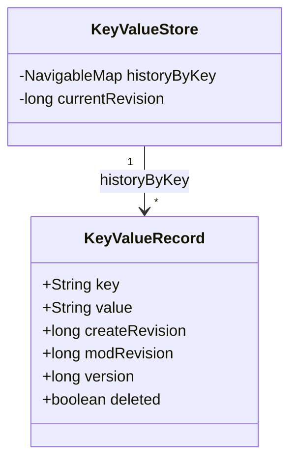
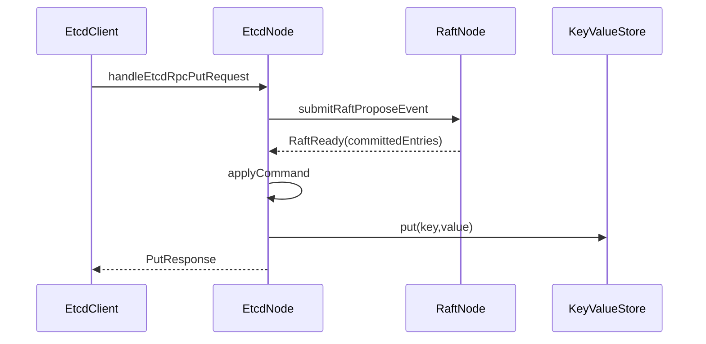
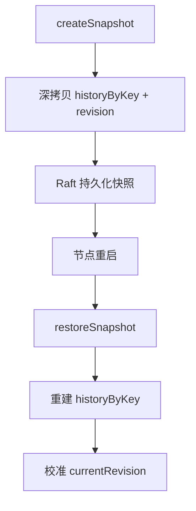

# MVCC 模块架构说明

## 1. 文档范围

本文只说明当前 `KeyValueStore` 的 MVCC 语义和真实执行路径：

1. 一次 KV 请求如何经过 `EtcdNode` 与 `RaftNode` 最终落到 `KeyValueStore`。
2. `currentRevision/createRevision/modRevision/version` 的关系。
3. `put/get/range/delete/deleteRange` 的边界与可见性规则。
4. 快照与恢复如何保持 MVCC 语义不变。

## 2. 小白先看：MVCC 到底在解决什么

同一个 key 会被多次写入。MVCC 的目标是：

1. 不覆盖历史，保留每次变更记录。
2. 能按“某个 revision 时刻”读取当时可见值。
3. 删除不是直接擦除，而是追加 tombstone（墓碑）记录。

一句话：MVCC 把“当前值”变成“可按时间回看的一段历史”。

## 3. 关键数据结构



结构解释：

1. `historyByKey`：key 有序；每个 key 对应一条历史列表。
2. `List<KeyValueRecord>`：按 `modRevision` 递增追加。
3. `currentRevision`：全局写时钟，所有 key 共用。

## 4. 四个 revision 字段如何配合

## 4.1 字段职责

1. `currentRevision`
- 全局时钟。
- 只有真实写变更才 +1。

2. `modRevision`
- 该条记录创建时的全局 revision。

3. `createRevision`
- 当前“存活代”第一次写入时的 revision。

4. `version`
- 当前“存活代”内单 key 变更次数。

## 4.2 一条 key 的生命周期示例

```text
put(k,v1)   -> rev=1, create=1, mod=1, version=1
put(k,v2)   -> rev=2, create=1, mod=2, version=2
delete(k)   -> rev=3, create=1, mod=3, version=3, deleted=true
put(k,v3)   -> rev=4, create=4, mod=4, version=1
```

关键点：`delete` 会结束旧存活代；后续 `put` 会开启新存活代。

## 5. 一次写请求如何落盘到状态机

以 `put` 为例：



`KeyValueStore.put` 的核心步骤：

1. 校验 key。
2. `nextRevision()` 推进全局 revision。
3. 找到 `revision-1` 时刻可见记录（可能为 null）。
4. 构造新 record：
- `modRevision=新revision`
- 若 previous 为 null：`createRevision=新revision, version=1`
- 否则继承 `createRevision` 且 `version+1`
5. 追加到 `historyByKey`。

## 6. 读请求怎么判定“可见记录”

读取核心方法是 `getVisibleRecordByRevision(key, revision)`：

1. 在该 key 的历史里找最后一个 `modRevision <= revision` 的记录。
2. 若没找到，返回 null。
3. 若找到但 `deleted=true`，也返回 null。
4. 否则返回该版本的可见拷贝。

这就是“历史保留，但删除对外不可见”的关键实现点。

## 7. Range/DeleteRange 边界统一模型

## 7.1 统一边界：`[startKey, endKeyExclusive)`

1. `endKeyExclusive` 为空：单 key。
2. 正常区间：`start <= key < end`。
3. 前缀查询：先把前缀转换成区间上界。

## 7.2 为什么前缀要算 `endKeyExclusive`

因为存储结构是有序 map，不是目录树。

前缀查询目标是“在有序空间取连续子区间”，而不是逐 key 调 `startsWith` 扫描。

`computePrefixEndKeyExclusive("app/")` 返回 `"app0"` 后，查询区间变成：

```text
["app/", "app0")
```

这样 `app/a`、`app/b` 命中，`apq/x` 不命中。

## 7.3 `computePrefixEndKeyExclusive` 循环含义

从后向前找第一位可 +1 字符：

1. 找到后该位 +1。
2. 截断其后尾部。
3. 得到“严格大于原前缀且最小”的上界。

这个上界用于构造稳定区间，不会漏 key，也不会多 key。

## 8. DeleteRange 的真实语义

`deleteRange(start,end,prefix,prevKv)` 执行顺序：

1. 先解析范围边界（与 `range` 同规则）。
2. 按当前可见视图收集待删项。
3. 若没有命中：不推进 revision，直接返回 deleted=0。
4. 若命中：只推进一次 revision，并为每项追加 tombstone。
5. `prevKv=true` 时返回删除前可见值。

这保证“查到什么删什么”，读删规则一致。

## 9. 快照与恢复



恢复关键点：

1. 先清空运行态，再从快照重建。
2. `currentRevision = max(snapshot.revision, 历史最大 modRevision)`。
3. 恢复后 `get/range` 在历史 revision 上的可见性规则不变。

## 10. 常见误解（小白重点）

1. 误解：`version` 就是全局版本号。
- 实际：`version` 只在单 key 当前存活代内递增。

2. 误解：删除会抹掉历史。
- 实际：删除是追加 tombstone，历史仍保留。

3. 误解：前缀查询必须有目录树。
- 实际：有序 key 空间 + 左闭右开区间就能实现稳定前缀查询。

4. 误解：没删到 key 也应该推进 revision。
- 实际：没有真实变更就不推进 revision。
