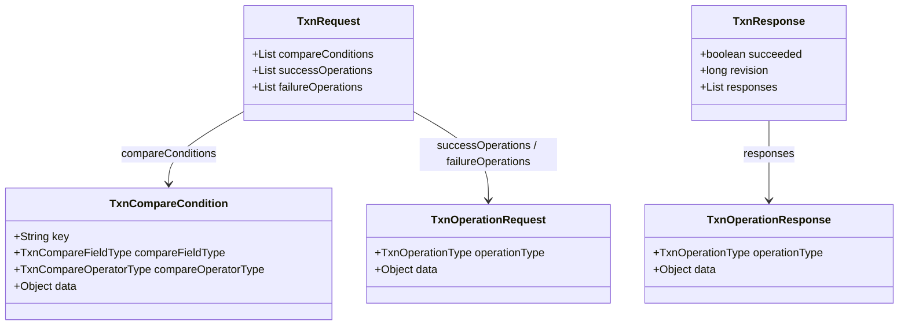
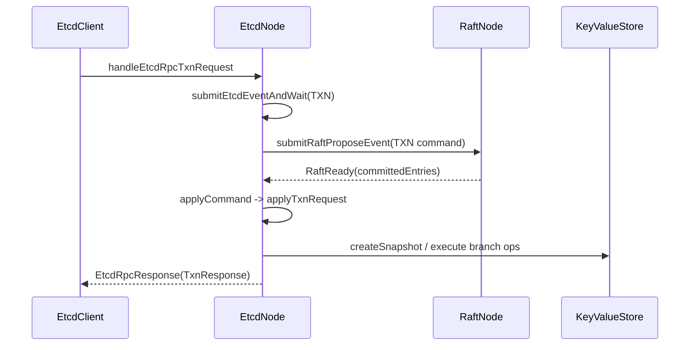
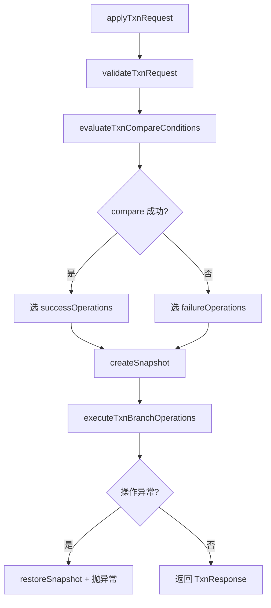

# Txn 模块架构说明

## 1. 文档范围

本文只说明当前事务能力：

1. `TxnRequest` 为什么采用 `compare + success/failure` 结构。
2. Txn 请求从 RPC 到 Raft 提交再到 apply 的真实方法链。
3. compare 判定、分支执行、回滚边界。
4. 响应结构与错误语义。

## 2. 小白先看：Txn 在做什么

Txn 不是“把很多请求打包一起发”这么简单。它保证的是：

1. 先在同一个状态视图里做 compare 判断。
2. 只执行一个分支（success 或 failure）。
3. 分支执行要么全部生效，要么全部回滚。

一句话：Txn 提供的是“条件判断 + 原子分支提交”。

## 3. 协议对象与设计动机



## 3.1 为什么统一 `type + data`

1. 请求和响应都走同一模式，结构对称。
2. 每种 operation/compare 的“类型决定数据解释方式”，扩展时不需要新增大量并行字段。
3. 通过 `dataAs(Class<T>)` 做显式类型检查，错误更早暴露。

## 3.2 compare data 的类型规则

1. `compareFieldType=VALUE` 时，`data` 必须是 `String`。
2. `compareFieldType=VERSION/CREATE_REVISION/MOD_REVISION` 时，`data` 必须是 `Long`。

## 4. Txn 请求全链路



核心方法链：

1. `handleEtcdRpcTxnRequest`
2. `submitEtcdEventAndWait`
3. `processEtcdEventFromQueue`
4. `submitEtcdCommandFromEvent`
5. `submitEtcdCommandAsync`
6. `raftNode.submitRaftProposeEvent`
7. `processRaftReadyAndAdvance`
8. `applyRaftReadyCommittedEntries`
9. `applyCommand`
10. `applyTxnRequest`

## 5. applyTxnRequest 执行步骤



顺序不可颠倒：

1. 先校验，防止非法请求进入状态机。
2. 再 compare，决定分支。
3. 再执行分支，并按顺序收集 response。
4. 任意异常统一回滚。

## 6. compare 语义细节

## 6.1 不存在 key 的基准值

当 compare 的 key 不存在：

1. `value = null`
2. `version = 0`
3. `createRevision = 0`
4. `modRevision = 0`

## 6.2 运算符规则

1. `EQUAL` / `NOT_EQUAL`：允许比较 `null`。
2. `GREATER` / `LESS`（针对 VALUE）：两边都非空才进行字符串比较，否则结果为 false。
3. 数值字段比较：使用 `Long.compare`，再映射到运算符。

## 6.3 校验链路

1. `validateTxnRequest`
2. `validateTxnCompareConditions`
3. `validateTxnCompareOperatorType`
4. `validateTxnCompareData`
5. `validateTxnBranchOperations`

校验的目标是提前挡住：空 key、空 type、data 类型错误、非法数值。

## 7. 分支操作执行

支持操作及执行映射：

1. `PUT` -> `applyPutRequest` -> `TxnOperationResponse.ofPut`
2. `DELETE` -> `applyDeleteRequest` -> `TxnOperationResponse.ofDelete`
3. `GET` -> `applyGetRequest` -> `TxnOperationResponse.ofGet`
4. `RANGE` -> `applyRangeRequest` -> `TxnOperationResponse.ofRange`
5. `DELETE_RANGE` -> `applyDeleteRangeRequest` -> `TxnOperationResponse.ofDeleteRange`

响应顺序与请求顺序完全一致。

## 8. 原子性与回滚边界

当前实现在 `applyTxnRequest` 中做事务边界控制：

1. 执行分支前先 `keyValueStore.createSnapshot()`。
2. 分支内任一操作抛异常时：`keyValueStore.restoreSnapshot(snapshotBeforeTxn)`。
3. 回滚后再把异常抛出，RPC 头返回失败。

这保证不会出现“前两步成功、第三步失败但前两步保留”的部分提交。

## 9. 响应语义（容易混淆）

1. `TxnResponse.succeeded=true`
- 表示 compare 成功，执行了 success 分支。

2. `TxnResponse.succeeded=false`
- 表示 compare 失败，执行了 failure 分支。
- 这不是错误。

3. RPC 头失败
- 仅在请求非法或执行异常（含回滚）时出现。

## 10. 两个完整例子

## 10.1 compare 成功

```text
compare: key=a, field=VALUE, op=EQUAL, data="v1"
success: put(a,"v2"), get(a)
failure: put(b,"x")
```

结果：

1. `succeeded=true`
2. `a` 更新为 `v2`
3. `b` 不受影响

## 10.2 compare 失败

```text
compare: key=a, field=VERSION, op=GREATER, data=10
success: put(a,"v2")
failure: put(b,"fallback")
```

结果：

1. `succeeded=false`
2. success 分支不执行
3. failure 分支执行

## 11. 常见误解（小白重点）

1. 误解：`succeeded=false` 就是事务失败。
- 实际：它只是命中了 failure 分支。

2. 误解：Txn 可以只走本地 apply 不经过 Raft。
- 实际：当前实现中 Txn 统一经 Raft 提交。

3. 误解：compare 和 branch 可能在不同状态点执行。
- 实际：二者都在同一次 apply 流程中完成。

4. 误解：分支执行到一半失败时，前面已执行部分会保留。
- 实际：会恢复快照，整事务回滚。
