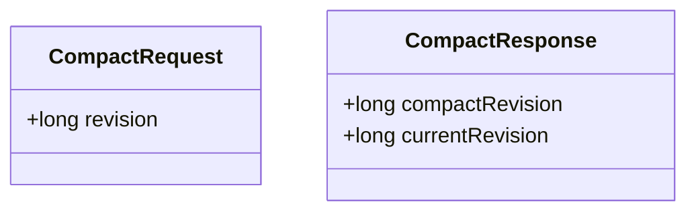
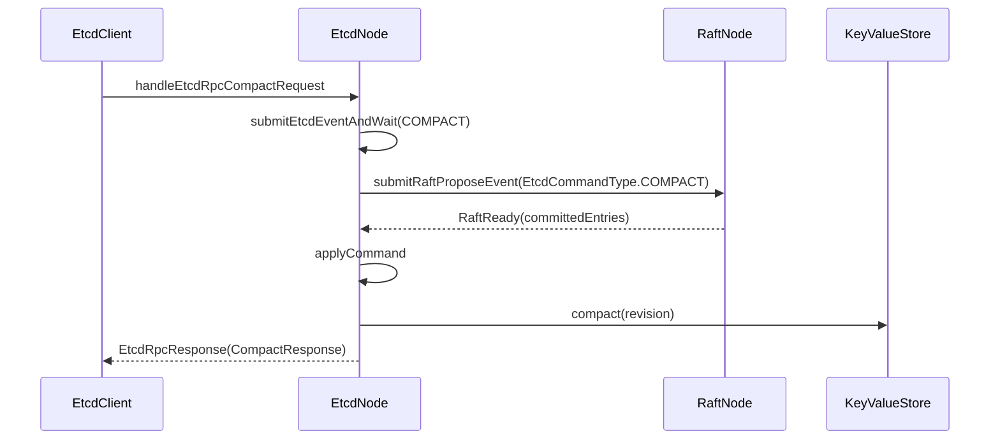

# Compact 模块架构说明

## 1. 文档范围

本文只描述当前 Compact 能力：

1. `CompactRequest(revision)` 的请求语义与边界。
2. Compact 从 RPC 到 Raft apply 的完整方法链。
3. `KeyValueStore` 历史压缩算法与 `compacted` 错误语义。
4. 快照恢复后 compact 边界保持一致的机制。

## 2. 小白先看：Compact 在做什么

Compact 不是“改当前值”，而是“缩短可回看的历史窗口”。

1. 当前值不变，`currentRevision` 不变。
2. 旧历史会被裁剪，`compactRevision` 前的历史读会报错。
3. Compact 边界必须走 Raft，保证多节点一致。

## 3. 协议对象

当前阶段只实现 `revision`，不引入 `physical` 字段。

## 4. 请求处理链路

关键方法链：

1. `EtcdClient.compact(...)`
2. `EtcdNode.handleEtcdRpcCompactRequest`
3. `submitEtcdEventAndWait(EtcdEventType.COMPACT, request)`
4. `processEtcdEventFromQueue -> submitEtcdCommandFromEvent`
5. `applyCommand -> applyCompactRequest`
6. `keyValueStore.compact(revision)`

## 5. KeyValueStore 压缩语义

## 5.1 状态字段

1. `currentRevision`：全局写时钟。
2. `compactRevision`：历史压缩边界，单调递增。

## 5.2 compact 输入校验

1. `revision <= 0`：报错。
2. `revision > currentRevision`：报错。
3. `revision <= compactRevision`：返回 `compacted` 错误语义。

## 5.3 压缩算法

对每个 key 的历史列表：

1. 保留所有 `modRevision > revision` 的记录。
2. 在 `modRevision <= revision` 区间里，找最后一条记录作为边界锚点。
3. 若锚点是可见值（非 tombstone），保留该锚点。
4. 若锚点是 tombstone，说明该 key 在边界前已删除，该 key 可整体清理。

## 5.4 历史读边界

`resolveReadRevision` 增加规则：

1. `requestedRevision < compactRevision`：直接抛 compacted 错误。
2. `requestedRevision == 0`：读取当前最新，不受 compact 拦截。

这条规则同时作用于 `get` 和 `range`。

## 6. Txn 交互语义

Txn 分支内的 `GET/RANGE` 若读取 compacted revision：

1. 读操作抛异常。
2. `applyTxnRequest` 捕获异常并 `restoreSnapshot(snapshotBeforeTxn)`。
3. 整个事务回滚，不留下部分写入。

## 7. 快照与恢复

`KeyValueStoreSnapshot` 增加 `compactRevision` 字段：

1. `createSnapshot` 同步保存 `revision + compactRevision + historyByKey`。
2. `restoreSnapshot` 同步恢复 `compactRevision`。

因此重启后历史读边界不会丢失，仍能稳定拒绝 compacted revision。

## 8. 对外错误模型

本阶段沿用当前响应模型，不新增结构化错误码：

1. `EtcdRpcResponse.header.success=false`
2. `header.message` 含 `compacted` 语义文本

## 9. 常见误解（小白重点）

1. 误解：Compact 会推进 revision。
- 实际：Compact 不产生新写，不推进 `currentRevision`。

2. 误解：Compact 会改变最新值。
- 实际：Compact 只裁剪历史，不改最新可见值。

3. 误解：`revision == compactRevision` 也不可读。
- 实际：禁止的是 `< compactRevision`，等于边界可读。

4. 误解：Compact 可以本地直接做，不走 Raft。
- 实际：Compact 边界是全局语义，必须经 Raft apply 串行提交。
