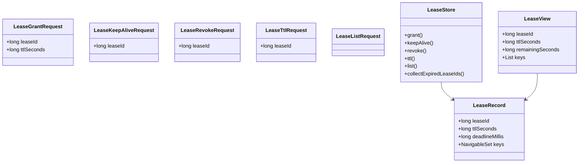
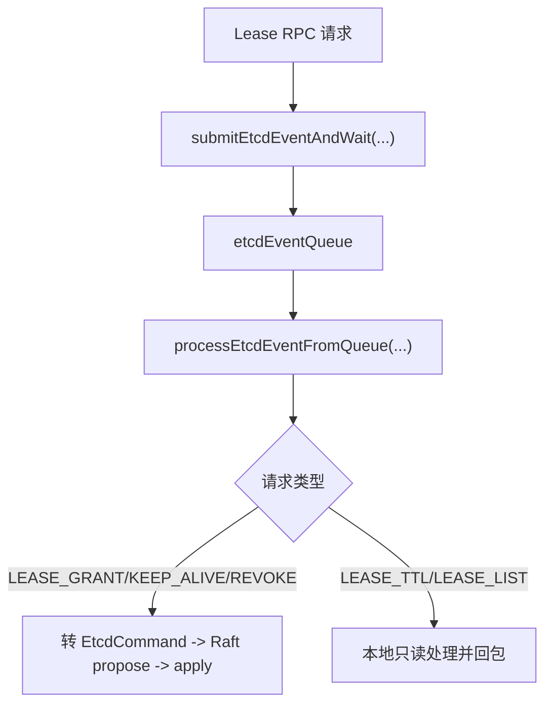
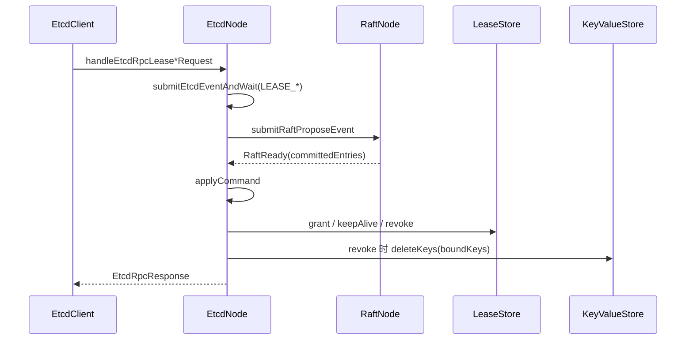
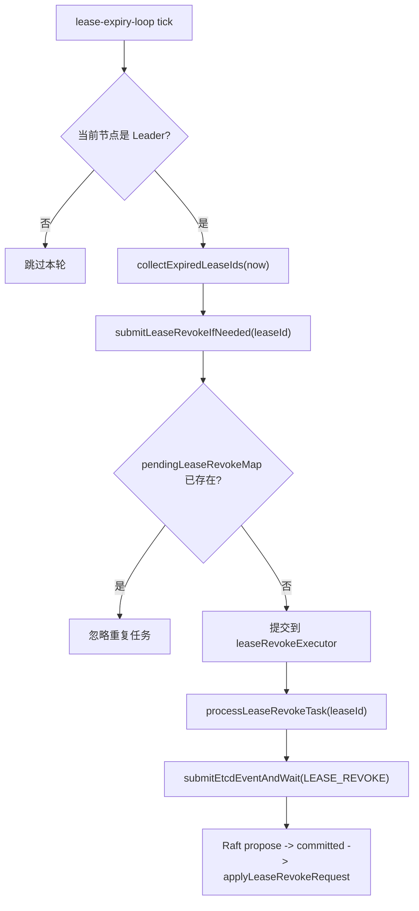

# Lease 模块架构说明

## 1. 文档范围

本文只描述当前已实现的 Lease 能力：

1. `grant / keepalive / revoke / ttl / list` 请求语义。
2. 写请求和读请求如何统一进入 `etcdEventQueue`。
3. `leaseExpiry` 自动过期删除执行链路。
4. key 与 lease 的绑定/解绑规则。
5. 快照与重启恢复语义。

## 2. 小白先看：Lease 解决什么问题

Lease 可以理解为“带失效时间的 key 生命周期控制器”。

1. 先创建 lease（例如 TTL=5 秒）。
2. 写 key 时绑定 lease。
3. keepalive 会续命，推迟过期时间。
4. revoke 或自然过期后，绑定 key 自动删除。

一句话：Lease 不只是查询 TTL，它会驱动 KV 删除。

## 3. 核心对象

核心说明：

1. `LeaseRecord` 是状态机内部数据，持有 `deadlineMillis` 与绑定 key 集合。
2. `LeaseView` 是返回给客户端的只读视图。
3. `leaseId=0` 表示自动分配；真正分配发生在 apply 阶段，确保所有节点按同一日志顺序得到同一结果。

## 4. 统一入口：所有 Lease 请求先进入 etcdEventQueue

当前实现中，Lease 写请求和读请求都先进入 `etcdEventQueue`，由 `event-loop` 统一调度。

这样做的价值：

1. RPC handler 不再分散执行业务逻辑。
2. 事件调度入口统一，代码路径更稳定。
3. 写请求与读请求共享同一套超时/错误回包通道。

## 5. 写路径：grant / keepalive / revoke

### 5.1 执行链路

关键方法链：

1. `EtcdNode.handleEtcdRpcLeaseGrantRequest / handleEtcdRpcLeaseKeepAliveRequest / handleEtcdRpcLeaseRevokeRequest`
2. `submitEtcdEventAndWait(EtcdEventType.LEASE_*)`
3. `processEtcdEventFromQueue -> submitEtcdCommandFromEvent`
4. `applyCommand -> applyLeaseGrantRequest / applyLeaseKeepAliveRequest / applyLeaseRevokeRequest`
5. `LeaseStore.grant / keepAlive / revoke`

### 5.2 为什么写请求必须走 Raft

1. lease 变更会影响最终 KV 内容（尤其 revoke/expire 删除 key）。
2. 必须通过日志复制与顺序 apply 才能保证多节点一致。
3. 崩溃恢复后可以按日志和快照重建相同状态。

## 6. 读路径：ttl / list

`LEASE_TTL` 与 `LEASE_LIST` 当前是只读语义：

1. 不写日志，不推进 MVCC revision。
2. 但仍先进入 `etcdEventQueue`，由 `processLeaseTtlEvent / processLeaseListEvent` 本地处理。
3. 若 lease 不存在，`ttl` 返回失败 header（`success=false`）。

## 7. key 与 lease 绑定规则

### 7.1 绑定

1. `PUT(leaseId>0)` 会在 `KeyValueRecord` 记录 leaseId。
2. `attachLeaseBindingIfNeeded(key, leaseId)` 把 key 加入 `LeaseRecord.keys`。

### 7.2 解绑

以下场景会解绑：

1. 普通 `DELETE/DELETE_RANGE` 删除 key。
2. `LEASE_REVOKE` 删除绑定 key。
3. key 重新绑定到新 lease 时，旧绑定先移除。

原则：`LeaseStore` 维护关系；真正 KV 删除由 `KeyValueStore` 完成。

## 8. leaseExpiry 自动过期删除

### 8.1 运行角色

1. `lease-expiry-loop`：周期扫描过期 lease。
2. `lease-revoke-executor`：并发执行撤销任务。
3. `pendingLeaseRevokeMap`：去重，避免同一 lease 短时间重复投递。

### 8.2 执行流程

### 8.3 为什么 LeaseStore 仍然使用 synchronized

Lease 相关访问并非只有单线程 event-loop：

1. event-loop 会执行 grant/keepalive/revoke/ttl/list。
2. `lease-expiry-loop` 会扫描过期 lease。
3. `lease-revoke-executor` 并发触发 revoke 任务。

因此 `LeaseStore` 需要内置并发保护，避免读写交错导致状态破坏。

## 9. 快照与恢复

Lease 状态与 KV 状态一起进入状态机快照：

1. `EtcdStateMachineSnapshot.keyValueStoreSnapshot`
2. `EtcdStateMachineSnapshot.leaseStoreSnapshot`

恢复时二者同时恢复，保证以下不变式：

1. 已撤销 lease 不会“复活”。
2. 已过期且已删除的 key 不会“复活”。
3. key 与 lease 绑定关系保持一致。

## 10. 常见误解

1. 误解：Lease 只是查询 TTL。
- 实际：Lease 是会影响 KV 结果的状态机能力。

2. 误解：过期扫描线程可以直接删 KV。
- 实际：扫描只发现，删除必须走 `LEASE_REVOKE -> Raft apply`。

3. 误解：`leaseId=0` 应该在 RPC 线程分配。
- 实际：当前实现在 apply 阶段自动分配，保证按日志顺序确定结果。

4. 误解：`ttl/list` 直接在 RPC handler 读就够了。
- 实际：当前实现也统一走 `etcdEventQueue`，保持调度风格一致。
