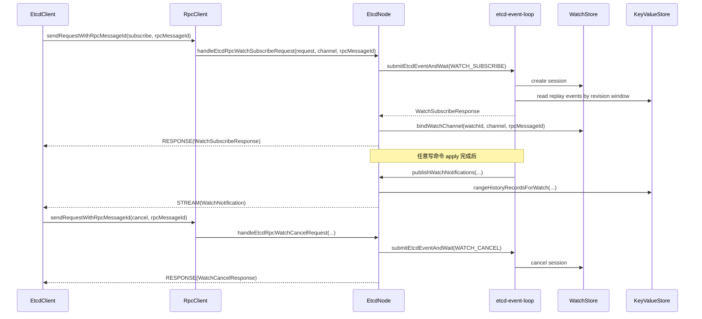
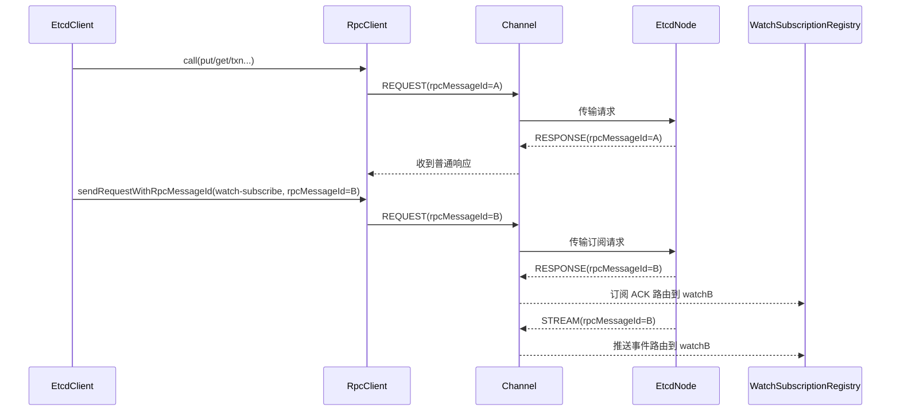

# Watch 模块架构说明

## 1. 范围

本文只描述当前已经实现的 Watch 能力：

1. `watch-subscribe / watch-cancel` 两个控制请求。
2. 同一 `endpoint` 下复用同一条 TCP/Channel，多个 watch 通过不同 `rpcMessageId` 路由。
3. `startRevision` 历史回放与增量通知。
4. `compactRevision` 边界下的取消语义。
5. Watch 在 `etcdEventQueue + event-loop` 中的统一调度路径。

## 2. 一眼看懂

当前 Watch 模型：

1. `subscribe/cancel` 是一元 `REQUEST/RESPONSE`。
2. 订阅成功后，服务端事件使用 `STREAM` 消息主动推送。
3. `watchId` 是业务会话标识，`rpcMessageId` 是 RPC 路由标识。
4. 一个 TCP/Channel 上可以同时存在多个 watch，靠不同 `rpcMessageId` 分流。
5. 是否要求 Leader 受理由请求中的 `leaderOnly` 字段控制，服务端据此受理或返回 `notLeader`。

一句话：控制面一元请求，数据面流式推送。

### 2.1 先把 3 个名字分清

1. `Channel`：底层 TCP 连接。
2. `rpcMessageId`：这条 TCP 连接里某一组请求/响应/推送的路由标签。
3. `watchId`：某一个 watch 会话自己的业务编号。

你可以把它理解成：

1. `Channel` 是“路”。
2. `rpcMessageId` 是“车牌号”。
3. `watchId` 是“乘客编号”。

### 2.2 同一条 TCP 上为什么能同时跑普通 RPC 和多个 watch

同一条 `Channel` 上并不只会有 watch 消息，还会有普通的 `put/get/range/txn/lease/compact` 请求。

原因很简单：

1. `RpcClient` 复用的是同一个 `Channel`。
2. 每次普通 RPC 调用都会绑定自己的请求标识和等待结果。
3. watch 订阅和取消也只是另一种 RPC 调用，只是它们会额外收到服务端主动推送的 `STREAM` 消息。
4. 只要消息里带着不同的 `rpcMessageId`，客户端就能把它们分发给不同的等待方或不同的 watch 订阅对象。

所以：

1. 普通 RPC 和 watch 可以共用一条 TCP。
2. 同一条 TCP 上可以同时存在多个 watch。
3. 这些 watch 之间不会串线，因为它们的 `rpcMessageId` 不同。
4. watch 和普通 RPC 也不会互相影响，因为它们在 RPC 层都只是“同一条连接上的不同消息”。

## 3. 核心对象

```mermaid
classDiagram
    class WatchSubscribeRequest {
      +long watchId
      +String startKey
      +String endKeyExclusive
      +boolean prefixMatch
      +long startRevision
      +int maxEvents
      +boolean leaderOnly
    }

    class WatchCancelRequest {
      +long watchId
    }

    class WatchSubscribeResponse {
      +long watchId
      +long currentRevision
      +long nextRevision
      +List_WatchEventView events
    }

    class WatchCancelResponse {
      +long watchId
      +boolean canceled
      +long currentRevision
    }

    class WatchNotification {
      +long watchId
      +long currentRevision
      +long nextRevision
      +boolean canceled
      +boolean compacted
      +long compactRevision
      +List_WatchEventView events
    }

    class WatchSubscription {
      +long watchId
      +String rpcMessageId
      +NodeEndpoint endpoint
      +WatchListener listener
    }

    class WatchSubscriptionRegistry {
      +register()
      +remove()
      +handle()
      +handleConnectionClosed()
    }

    class WatchSession {
      +long watchId
      +String startKey
      +String endKeyExclusive
      +boolean prefixMatch
      +long nextRevision
      +Channel channel
      +String rpcMessageId
    }

    class WatchStore {
      +create()
      +bindWatchChannel()
      +updateNextRevision()
      +cancel()
      +cancelByChannelId()
    }
```

说明：

1. `WatchSubscription` 只负责客户端单个 watch 的生命周期、握手 ACK 和回调收尾。
2. `WatchSubscriptionRegistry` 负责客户端分发，按 `watchId / rpcMessageId` 维护映射并处理入站消息。
3. `RpcClient` 负责底层连接复用和消息投递，watch 只是它承载的一种业务。
3. `WatchStore` 负责服务端会话元数据和 `channel + rpcMessageId` 绑定。
4. `WatchNotification` 同时承载正常事件和 compact 取消事件。

## 4. 端到端链路

### 4.1 普通 RPC 和多个 watch 如何共用同一条 Channel

这个图要表达的意思是：

1. `RpcClient` 不是为每个请求新建 TCP，而是复用已经建立好的 `Channel`。
2. 普通 RPC 和 watch 都是往同一条 `Channel` 里发消息。
3. 区分消息归属靠的是 `rpcMessageId`，不是靠再开一条连接。

## 5. 客户端流程

### 5.1 订阅建立

`EtcdClient.watch(request, listener)`：

1. 客户端发送 `watch-subscribe` 控制请求并按自身路由策略选择目标节点。
2. 优先尝试当前路由节点，若返回 `notLeader + leaderId`，则切换到 leader 重试。
3. 为该 watch 生成独立 `watchId` 和 `rpcMessageId`。
4. 先注册到 `WatchSubscriptionRegistry`，再发送 `subscribe` 请求，避免响应先到导致找不到订阅上下文。
5. 阻塞等待首帧 `WatchSubscribeResponse`：
   - 成功：返回 `WatchHandle`。
   - 失败：清理上下文并抛错。

`WatchSubscriptionRegistry` 在这里的作用很直接：

1. 先把 `rpcMessageId -> WatchSubscription` 建好。
2. 等 RPC 层把响应或推送消息收到后，再按 `rpcMessageId` 找到对应的订阅对象。
3. 订阅对象再去决定这是握手响应、取消响应还是普通事件。

`EtcdClient.watch(request, endpoint, listener)`：

1. 调用方显式指定目标节点。
2. 请求参数约束由 SDK 侧负责校验，本文不展开客户端参数策略。
3. 不做 leader 跳转，只按指定节点建立或失败。

### 5.2 取消

`WatchHandle.cancel()`：

1. 用同一个 `rpcMessageId` 发送 `watch-cancel`。
2. 收到 `WatchCancelResponse` 后清理本地订阅和 handler 注册。
3. 取消是本地会话收口，不关闭整个 TCP/Channel。

### 5.3 推送分发

`WatchSubscriptionRegistry` 对同一连接上的多个 watch 做统一分发：

1. `RESPONSE`：处理 subscribe/cancel。
2. `STREAM`：反序列化 `WatchNotification`，按 `rpcMessageId` 找到目标订阅。
3. `ERROR / 连接关闭`：回调错误并清理订阅。
4. 如果监听器处理消息时抛异常，客户端直接关闭该 watch，不做自动重连。

### 5.4 `WatchSubscriptionRegistry` 和 `WatchSubscription` 的分工

这两个类不要混着看：

1. `WatchSubscriptionRegistry` 只做“找人”和“清理人”。
2. `WatchSubscription` 只做“这个 watch 自己该怎么处理消息”。

更具体一点：

1. `Registry` 看到入站消息后，先按 `rpcMessageId` 找到对应订阅。
2. 找到后把消息交给 `WatchSubscription.handleMessage(...)`。
3. `WatchSubscription` 再根据消息类型决定是订阅 ACK、取消 ACK 还是事件推送。
4. 如果 `WatchSubscription` 终止了，`Registry` 会把这条 `rpcMessageId` 对应的注册关系清掉。

## 6. 服务端流程

### 6.1 订阅

`EtcdNode.handleEtcdRpcWatchSubscribeRequest(request, channel, rpcMessageId)`：

1. 如果 `request.leaderOnly=true` 且当前节点不是 Leader，直接返回 `notLeader + leaderId`。
2. 否则把 `WATCH_SUBSCRIBE` 投递到 event-loop。
3. `applyWatchSubscribeRequest` 校验参数、计算回放窗口、创建会话、构建响应。
4. 订阅成功后调用 `watchStore.bindWatchChannel(...)` 绑定会话路由。
5. 首帧 `WatchSubscribeResponse` 先进入 `WatchChannelWriteRegistry` 写队列，随后再启用会话推送开关。

### 6.4 首帧顺序保证（当前实现）

1. subscribe 成功后先发送首帧 `WatchSubscribeResponse`。
2. 只有首帧响应已入队，才启用会话 `notificationPushEnabled`。
3. 后续 `WatchNotification` 与首帧响应共用同一 channel 写队列串行发送。
4. 因此服务端侧顺序稳定为：先 `WatchSubscribeResponse`，后 `WatchNotification`。

### 6.2 实时通知

写命令 apply 成功后触发 `publishWatchNotifications(...)`：

1. 遍历所有活跃会话。
2. 读取 `[nextRevision, currentRevision]` 的事件窗口。
3. 构造并写出 `STREAM(WatchNotification)`。
4. 推进会话 `nextRevision`。
5. 如果通道已关闭，则回收该会话。

### 6.3 取消与回收

1. `watch-cancel` 进入 `WATCH_CANCEL` 事件后删除会话。
2. 不主动关闭 channel，连接仍可承载其他 RPC。
3. channel 关闭时由 `closeFuture` 触发 `cancelByChannelId` 回收该连接上的所有 watch。

## 7. revision 语义

### 7.1 startRevision

1. `startRevision=0`：从 `currentRevision + 1` 开始，仅接收未来事件。
2. `startRevision>0`：先回放历史，再进入增量推送。

### 7.2 nextRevision

1. `nextRevision` 是会话游标，表示下一次读取起点（含）。
2. 每次推送后推进到“最后一条事件 revision + 1”。

## 8. compact 边界

### 8.1 订阅阶段

当 `startRevision > 0` 且 `startRevision < compactRevision`：

1. subscribe 返回 compacted 语义错误。

### 8.2 推送阶段

当会话 `nextRevision < compactRevision`：

1. 会话取消。
2. 推送 `canceled=true && compacted=true` 的通知。

## 9. 恢复语义

1. Watch 会话是内存态，不进入快照。
2. 节点重启后原会话不恢复。
3. 客户端按 `startRevision` 重新订阅后可回放缺失事件。

## 10. 典型场景

### 10.1 默认订阅

1. 客户端调用 `watch(request, listener)`。
2. 客户端按自身路由策略选择目标节点并发起订阅。
3. 若首个节点不是 Leader，客户端根据 `notLeader + leaderId` 重试。
4. 成功后，后续写入事件通过同一订阅持续推送。
5. 这时同一 `RpcClient` 还可以继续处理其他普通 RPC，不会被 watch 占住。

### 10.2 指定节点订阅

1. 客户端调用 `watch(request, endpoint, listener)`。
2. 请求参数组合合法性由 SDK 负责校验后再发起订阅。
3. 适合明确希望挂在某个节点上观察事件时使用。
4. 这个 watch 仍然和普通 RPC 共用同一个 `RpcClient` 和同一条 TCP。

## 11. 关键实现点

1. `EtcdClient.watch(...)`
2. `WatchSubscriptionRegistry.handle(...)`
3. `WatchSubscription.handleMessage(...)`
4. `EtcdNode.handleEtcdRpcWatchSubscribeRequest(...)`
5. `EtcdNode.publishWatchNotifications(...)`
6. `WatchStore.create/bindWatchChannel/cancel/cancelByChannelId`
