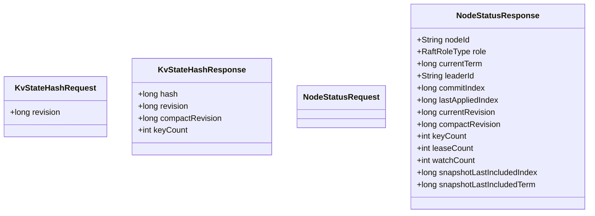
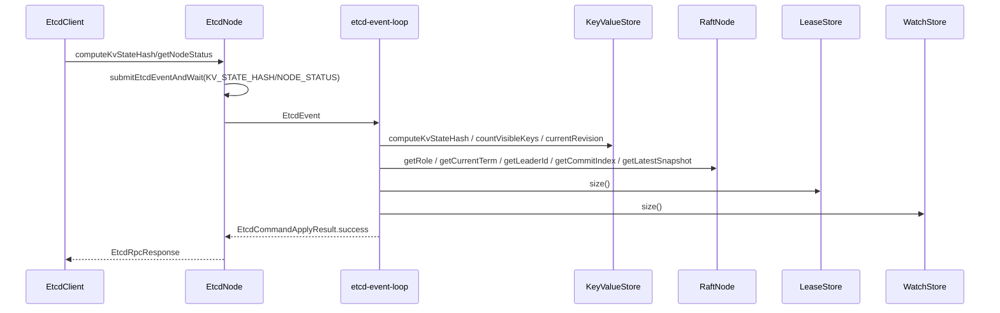

# 诊断模块架构说明

## 1. 文档范围

本文只描述当前已经实现并对外可用的两类诊断读能力：

1. `KvStateHashRequest` / `KvStateHashResponse`
2. `NodeStatusRequest` / `NodeStatusResponse`

这两类请求都属于“本地诊断读”：

1. 不写状态机。
2. 不进入 Raft 共识。
3. 只读取当前节点当下看到的运行态。

## 2. 小白先看：诊断模块到底在做什么

可以把这两个接口理解成两种体检：

1. `KvStateHash`：体检“当前 KV 数据视图是否一致”。
2. `NodeStatus`：体检“当前节点运行是否正常”。

一句话：

1. `KvStateHash` 看“数据像不像”。
2. `NodeStatus` 看“节点稳不稳”。

## 3. 协议对象

字段直觉解释：

1. `KvStateHashRequest.revision`：想看哪个 revision 的可见 KV 视图；`0` 表示最新。
2. `KvStateHashResponse.hash`：该视图的状态摘要。
3. `NodeStatusResponse.role/term/leaderId`：Raft 运行态。
4. `NodeStatusResponse.currentRevision/compactRevision`：MVCC 进度与压缩边界。
5. `NodeStatusResponse.keyCount/leaseCount/watchCount`：当前节点上可观测的业务规模。

## 4. 请求处理链路

关键方法链：

1. `EtcdClient.computeKvStateHash(...)` / `EtcdClient.getNodeStatus(...)`
2. `EtcdNode.handleEtcdRpcKvStateHashRequest(...)` / `EtcdNode.handleEtcdRpcNodeStatusRequest(...)`
3. `submitEtcdEventAndWait(...)`
4. `processEtcdEventFromQueue(...)`
5. `processKvStateHashEvent(...)` / `processNodeStatusEvent(...)`
6. `readKvStateHashRequest(...)` / `readNodeStatusRequest(...)`

说明：

1. 它们也走 `etcd-event-loop`，是为了入口风格统一。
2. 统一入口不代表要进 Raft，共识开销依然为 0。

## 5. KvStateHash 语义

### 5.1 它哈希的是什么

`KvStateHash` 哈希的是“某个 revision 下可见的 KV 视图”，不是“日志内容”。

1. 只看可见记录。
2. 不把 `revision` 数字本身混入哈希。
3. 输入一致就能得到一致哈希，适合跨节点快速对账。

### 5.2 FNV 在这里的作用

当前实现使用 `FNV-1a 64-bit`（Fowler-Noll-Vo）做摘要：

1. 算法简单，速度快。
2. 跨平台实现稳定，适合一致性对账。
3. 它不是加密哈希，不用于安全签名。

### 5.3 revision 边界

1. `revision=0`：读取最新 revision。
2. `revision>currentRevision`：非法，返回失败。
3. `revision<compactRevision`：历史已压缩，返回 compacted 语义失败。

### 5.4 keyCount 的意义

`keyCount` 表示“参与本次哈希的可见 key 数量”。

1. 可用于快速判断状态规模是否一致。
2. 结合 `hash` 一起看，能更快定位问题。

## 6. NodeStatus 语义

`NodeStatus` 返回的是当前节点本地运行快照：

1. Raft：`role/currentTerm/leaderId/commitIndex/lastAppliedIndex`
2. MVCC：`currentRevision/compactRevision/keyCount`
3. 子系统规模：`leaseCount/watchCount`
4. 快照边界：`snapshotLastIncludedIndex/snapshotLastIncludedTerm`

小白理解方式：

1. `KvStateHash` 更像“数据指纹”。
2. `NodeStatus` 更像“节点仪表盘”。

## 7. 为什么诊断读不进入 Raft

根本原因：它们不改变系统状态。

1. 不写 KV。
2. 不改 Lease。
3. 不改 Watch。
4. 不改 Raft 核心状态。

所以无需共识；否则只会增加延迟和系统负担。

## 8. 常见误解（小白重点）

1. 误解：诊断请求也必须走 Leader。
- 实际：它们是本地只读，Leader/Follower 都可以处理。

2. 误解：`KvStateHash` 是安全校验。
- 实际：它是状态一致性摘要，不是安全签名。

3. 误解：`NodeStatus` 是整个集群的全局视图。
- 实际：它是“当前节点本地视图”，要做集群判断需要多节点对比。

4. 误解：走 `etcd-event-loop` 就等于走 Raft。
- 实际：event-loop 只是统一调度入口，本模块不会 propose 日志。

## 9. 典型使用案例

### 9.1 多节点一致性快检

1. 对 leader 和 follower 分别调用 `computeKvStateHash(0)`。
2. 比较 `hash/revision/keyCount`。
3. 若三者一致，通常说明当前可见状态一致。

### 9.2 运行态排查

1. 对多个节点调用 `getNodeStatus()`。
2. 比较 `role/leaderId` 是否合理。
3. 比较 `currentRevision/compactRevision` 是否大体同步。
4. 观察 `leaseCount/watchCount` 是否异常偏高。

### 9.3 compact 之后的边界验证

1. 执行 compact。
2. 再对旧 revision 做 `computeKvStateHash(oldRevision)`。
3. 预期返回 compacted 语义失败。
4. 同时用 `getNodeStatus()` 确认 `compactRevision` 已推进。