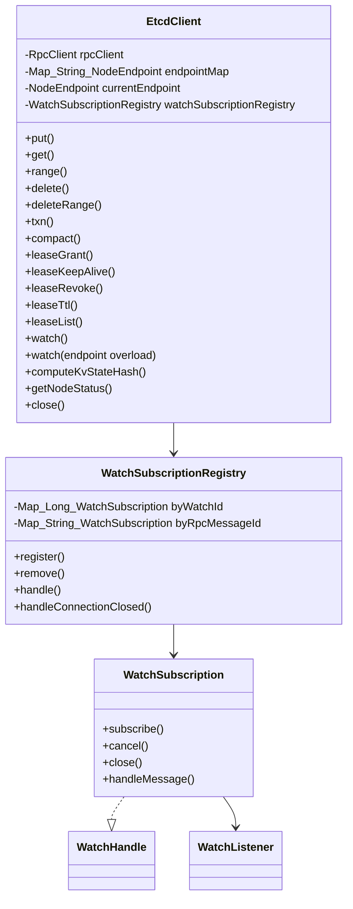
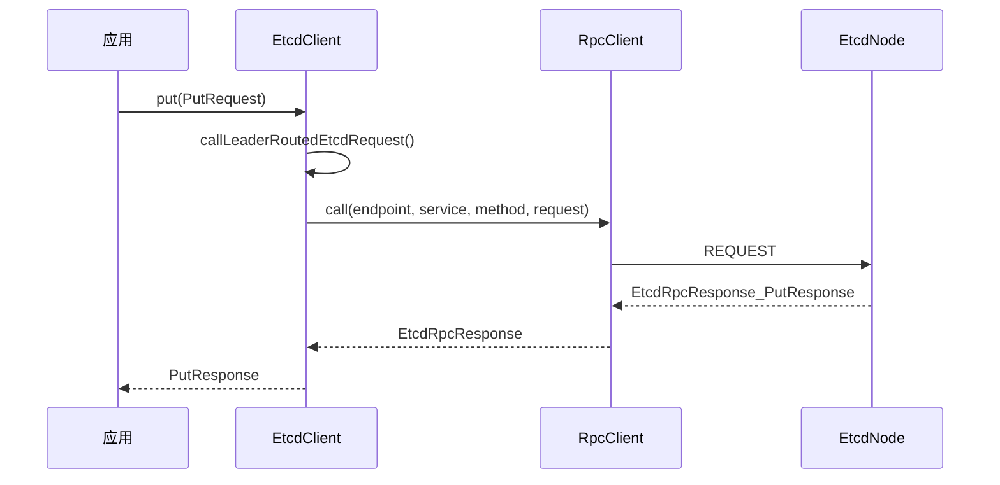
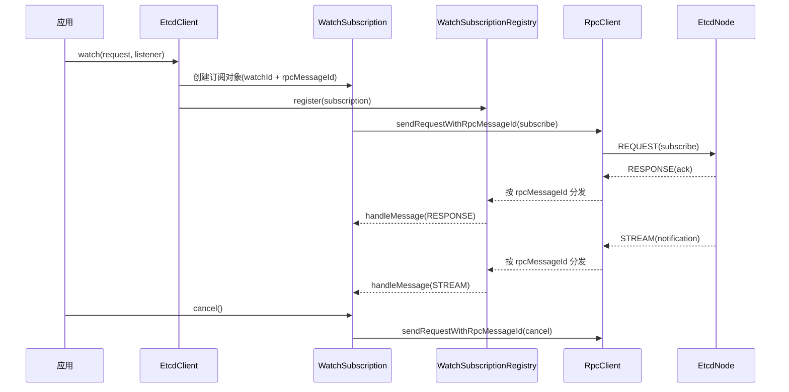

# SDK 模块架构说明

## 1. 文档范围

本文只说明当前 `etcd-sdk` 已实现的真实能力：

1. `EtcdClient` 如何把业务请求发到集群。
2. Leader 路由、本地读分流、连接复用的执行逻辑。
3. watch 在“同一 TCP 连接”下的订阅、取消、推送分发。
4. SDK 这一层和内核层的职责边界。

## 2. 小白先看：SDK 现在是什么

当前 SDK 的对外入口就是一个类：`com.xhj.etcd.sdk.client.EtcdClient`。

你可以把它理解成：

1. 对应用暴露统一 API（`put/get/range/txn/lease/watch`）。
2. 帮你处理“找 Leader / 重试 Leader”这类客户端路由细节。
3. 帮你把 watch 的控制请求和推送消息对齐到同一个会话。

它不做的事：

1. 不实现共识协议（那是 `etcd-kernel` 的职责）。
2. 不重写一套 RPC 传输层（复用 `etcd-rpc`）。
3. 不再做多层套壳客户端封装。

## 3. 核心类关系



## 4. 一次普通请求的最短路径（以 PUT 为例）



关键点：

1. SDK 不改写业务 DTO，仍使用内核定义的 `XxxRequest/XxxResponse`。
2. SDK 只做“路由+调用+返回体类型校验”。
3. 是否成功由服务端响应头和业务体共同表达。

## 5. Leader 路由与本地读分流

## 5.1 Leader 路由（写请求、Txn、Lease、Compact）

这些请求统一走 `callLeaderRoutedEtcdRequest`：

1. 从 `currentEndpoint` 开始请求。
2. 若响应是 `notLeader + leaderId`，则跳到已知 Leader endpoint 重试。
3. 成功后把 `currentEndpoint` 更新为可用目标，便于下次更快命中。

## 5.2 本地读分流（Get/Range）

1. `linearizableRead=true`：走 Leader 路由，保证线性一致。
2. `linearizableRead=false`：走 `callCurrentEtcdRequest`，直接请求当前 endpoint。

这让调用方可以明确选择“最强一致”或“本地读取”。

## 6. Watch：同一 TCP 连接上的多订阅

## 6.1 先记住三个标识

1. `endpoint`：目标节点。
2. `watchId`：业务会话标识（谁的订阅）。
3. `rpcMessageId`：RPC 路由标识（消息分发到哪个本地订阅对象）。

## 6.2 执行流程



## 6.3 为什么能多订阅共用一条连接

因为底层连接是按 `endpoint` 复用的，消息分发靠 `rpcMessageId` 区分。

同一节点上同时有多个 watch 时：

1. 连接可以是同一条 TCP channel。
2. 每个 watch 用不同 `rpcMessageId`。
3. `WatchSubscriptionRegistry` 用 map 把消息准确路由到对应订阅。

## 6.4 leaderOnly 与指定 endpoint 的约束

1. `watch(request, listener)`：不改写 `request.leaderOnly`，严格遵循调用方语义。
2. `watch(request, endpoint, listener)`：用于显式指定节点观察；该模式禁止 `leaderOnly=true`，否则直接抛参错。
3. `leaderOnly=true` 时，收到 `notLeader + leaderId` 会按 leader 跳转重试。
4. `leaderOnly=false` 时，不做 leader 跳转，按候选节点顺序尝试。

## 7. 资源与生命周期边界

`EtcdClient` 有两种构造语义：

1. 传入外部 `RpcClient`：`close()` 不会关闭外部客户端。
2. 使用默认构造创建内部 `NettyRpcClient`：`close()` 会关闭该客户端。

watch 生命周期：

1. `watch()` 成功后返回 `WatchHandle`。
2. `cancel()` 发送取消并等待 ACK。
3. 连接关闭或消息处理异常时，订阅会被注册表清理并关闭。

### 7.1 cancel 收敛语义与可容忍边界

1. `cancel()` 成功返回后，本地句柄会收敛为 `CLOSED`（当前实现保证）。
2. 关闭路径会清理 `WatchSubscriptionRegistry` 与 RPC handler，避免后续持续路由到已关闭订阅。
3. 在无 ACK/序列屏障协议下，极小的 in-flight 并发窗口仍可能存在，偶发尾部消息属于可容忍边界。
4. 若业务要求“cancel 后绝对零回调”，需要协议升级（ACK、序列屏障或更强串行化模型）。

## 8. SDK 与内核测试分工

当前分工是：

1. `etcd-kernel`：负责完整分布式语义和边界场景测试。
2. `etcd-sdk`：负责客户端契约与轻量真实网络 smoke。

SDK 当前测试文件：

1. `EtcdClientSdkBehaviorTest`：构造与资源生命周期契约。
2. `EtcdClientNetworkSmokeTest`：真实网络下 `put/get + watch subscribe/cancel` 最小闭环。

## 9. 最小使用示例

```java
List<NodeEndpoint> endpoints = new ArrayList<>();
endpoints.add(new NodeEndpoint("n1", "127.0.0.1", 2380));
endpoints.add(new NodeEndpoint("n2", "127.0.0.1", 2381));
endpoints.add(new NodeEndpoint("n3", "127.0.0.1", 2382));

EtcdClient client = new EtcdClient(endpoints);
try {
    client.put(new PutRequest("app/config/name", "mini-etcd"));
    GetResponse getResponse = client.get(new GetRequest("app/config/name"));
    System.out.println(getResponse.getValue());
} finally {
    client.close();
}
```
