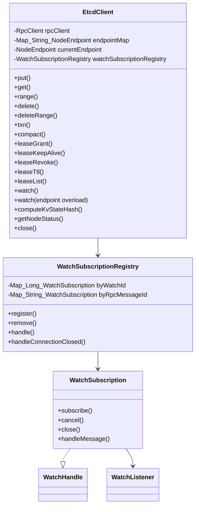
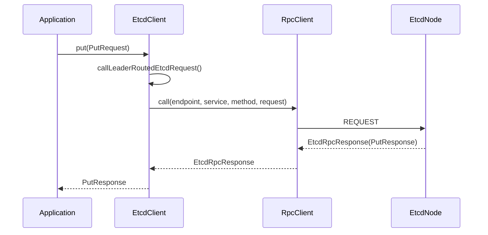
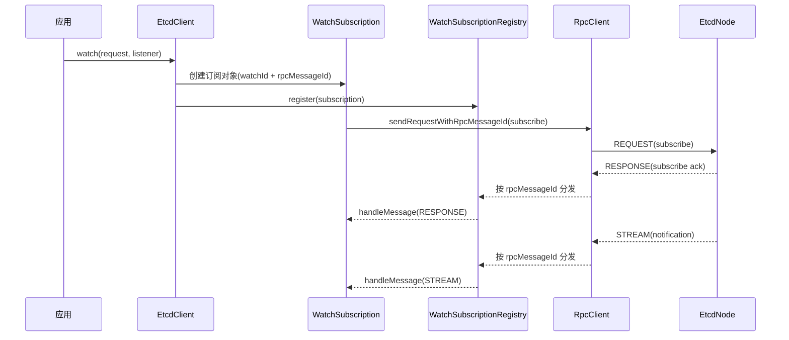

# SDK 模块架构说明

## 1. 文档范围

本文只说明当前 `etcd-sdk` 已实现的能力：

1. `EtcdClient` 的请求路由与调用模型。
2. Leader 路由与本地读分流规则。
3. watch 在同一 TCP 连接上的多路复用机制。
4. watch cancel 收敛语义与当前边界。

## 2. 小白先看：SDK 现在是什么

SDK 的对外入口是一个类：`com.xhj.etcd.sdk.client.EtcdClient`。

它负责：

1. 暴露统一 API（`put/get/range/delete/txn/compact/lease/watch`）。
2. 处理客户端路由（leader 重试、指定节点访问）。
3. 管理 watch 的订阅、取消、消息分发。

它不负责：

1. 共识协议与状态机执行（由 `etcd-kernel` 负责）。
2. 底层传输协议实现（复用 `etcd-rpc`）。

## 3. 核心类关系


```mermaid
classDiagram
    class EtcdClient {
      -RpcClient rpcClient
      -Map_String_NodeEndpoint endpointMap
      -NodeEndpoint currentEndpoint
      -WatchSubscriptionRegistry watchSubscriptionRegistry
      +put()
      +get()
      +range()
      +delete()
      +deleteRange()
      +txn()
      +compact()
      +leaseGrant()
      +leaseKeepAlive()
      +leaseRevoke()
      +leaseTtl()
      +leaseList()
      +watch()
      +watch(endpoint overload)
      +computeKvStateHash()
      +getNodeStatus()
      +close()
    }

    class WatchSubscriptionRegistry {
      -Map_Long_WatchSubscription byWatchId
      -Map_String_WatchSubscription byRpcMessageId
      +register()
      +remove()
      +handle()
      +handleConnectionClosed()
    }

    class WatchSubscription {
      +subscribe()
      +cancel()
      +close()
      +handleMessage()
    }

    class WatchHandle
    class WatchListener

    EtcdClient --> WatchSubscriptionRegistry
    WatchSubscriptionRegistry --> WatchSubscription
    WatchSubscription ..|> WatchHandle
    WatchSubscription --> WatchListener
```

## 4. 普通请求最短路径（以 PUT 为例）


```mermaid
sequenceDiagram
    participant App as Application
    participant Client as EtcdClient
    participant Rpc as RpcClient
    participant Node as EtcdNode

    App->>Client: put(PutRequest)
    Client->>Client: callLeaderRoutedEtcdRequest()
    Client->>Rpc: call(endpoint, service, method, request)
    Rpc->>Node: REQUEST
    Node-->>Rpc: EtcdRpcResponse(PutResponse)
    Rpc-->>Client: EtcdRpcResponse
    Client-->>App: PutResponse
```

关键点：

1. SDK 不改写 `etcdrpc` 请求/响应类型。
2. SDK 统一校验 `EtcdRpcResponse.header.success`，失败直接抛异常。
3. 写请求只有在服务端成功返回后才算调用成功。

## 5. Leader 路由与本地读分流

### 5.1 Leader 路由（写请求、Txn、Lease、Compact）

这些请求走 `callLeaderRoutedEtcdRequest`：

1. 从 `currentEndpoint` 发起调用。
2. 若返回 `notLeader + leaderId`，尝试跳转到已知 leader。
3. 成功后更新 `currentEndpoint`。

### 5.2 本地读分流（Get/Range）

1. `linearizableRead=true`：走 leader 路由。
2. `linearizableRead=false`：走当前节点本地读。

### 5.3 指定节点调用

诊断或教学场景可使用指定 endpoint 的方法（如 `rangeOnEndpoint/getNodeStatusOnEndpoint`）：

1. 仅请求指定节点。
2. 不更新 `currentEndpoint`，避免污染主业务路由状态。

## 6. Watch：同一 TCP 连接多订阅

### 6.1 三个标识

1. `endpoint`：订阅目标节点。
2. `watchId`：业务订阅会话 ID。
3. `rpcMessageId`：RPC 路由 ID（用于同连接多路分发）。

### 6.2 订阅与推送流程


```mermaid
sequenceDiagram
    participant App as 应用
    participant Client as EtcdClient
    participant Sub as WatchSubscription
    participant Reg as WatchSubscriptionRegistry
    participant Rpc as RpcClient
    participant Node as EtcdNode

    App->>Client: watch(request, listener)
    Client->>Sub: 创建订阅对象(watchId + rpcMessageId)
    Client->>Reg: register(subscription)
    Sub->>Rpc: sendRequestWithRpcMessageId(subscribe)
    Rpc->>Node: REQUEST(subscribe)
    Node-->>Rpc: RESPONSE(subscribe ack)
    Rpc-->>Reg: 按 rpcMessageId 分发
    Reg-->>Sub: handleMessage(RESPONSE)
    Node-->>Rpc: STREAM(notification)
    Rpc-->>Reg: 按 rpcMessageId 分发
    Reg-->>Sub: handleMessage(STREAM)
```

### 6.3 为什么能共用一条连接

同一 endpoint 的连接由 RPC 层复用，watch 的多路并发靠 `rpcMessageId` 分流：

1. 多个 watch 可以落在同一 TCP channel。
2. 每个 watch 绑定不同 `rpcMessageId`。
3. `WatchSubscriptionRegistry` 用 `rpcMessageId -> WatchSubscription` 精确路由。

### 6.4 `WatchListener` 与 `WatchHandle` 关系

当前实现是“一对一”：

1. 每次 `watch(...)` 会创建一个 `WatchSubscription`（实现 `WatchHandle`）。
2. SDK 会调用 `listener.bindWatchHandle(subscription)` 绑定该句柄。
3. 一个 `WatchListener` 实例不应复用到多个并发 watch。

### 6.5 `leaderOnly` 与指定 endpoint 约束

1. `watch(request, listener)`：遵循 `request.leaderOnly` 原始值，不在 SDK 强制覆写。
2. `watch(request, endpoint, listener)`：显式指定节点模式下禁止 `leaderOnly=true`。
3. `leaderOnly=true`：允许根据 `notLeader + leaderId` 跳转重试。
4. `leaderOnly=false`：按候选节点顺序尝试，允许订阅 follower。

## 7. Watch cancel 语义与边界

### 7.1 已保证的行为

1. `cancel()` 会发送取消请求并等待取消 ACK。
2. 成功路径会执行本地 `close()` 收敛，句柄进入 `CLOSED`。
3. 关闭时会清理注册表与 rpc handler，防止后续持续路由。

### 7.2 当前可容忍窗口

在“无 ACK 序列屏障”的前提下，存在极小并发窗口：

1. `future` 完成与路由移除不是同一原子操作。
2. 极少量 in-flight 消息可能在关闭边界附近到达。
3. 这类尾部消息属于当前设计的可容忍边界。

若业务要求“cancel 返回后绝对零回调”，需要协议增强（序列屏障或更强串行化）。

## 8. `close()` 语义（当前实现）

当前 `EtcdClient.close()` 会直接调用 `rpcClient.shutdown()`。

这意味着：

1. 关闭 `EtcdClient` 会关闭其持有的 RPC 客户端。
2. 若多个组件共享同一个 `RpcClient`，调用方需要自行管理关闭时机。

## 9. SDK 测试分工

`etcd-sdk` 当前测试重点是客户端契约，不重复覆盖内核全部分布式边界：

1. `EtcdClientSdkBehaviorTest`：构造、参数、生命周期行为。
2. `EtcdClientNetworkSmokeTest`：真实网络 smoke（含 watch 订阅/取消）。

## 10. 最小使用示例

```java
List<NodeEndpoint> endpoints = new ArrayList<>();
endpoints.add(new NodeEndpoint("n1", "127.0.0.1", 2379));
endpoints.add(new NodeEndpoint("n2", "127.0.0.1", 2380));
endpoints.add(new NodeEndpoint("n3", "127.0.0.1", 2381));

EtcdClient client = new EtcdClient(endpoints);
try {
    client.put(new PutRequest("app/config/name", "mini-etcd"));
    GetResponse getResponse = client.get(new GetRequest("app/config/name"));
    System.out.println(getResponse.getValue());
} finally {
    client.close();
}
```
