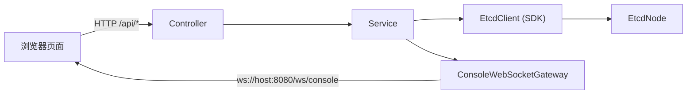

# Console 模块架构说明

## 1. 文档范围

本文对应当前 `etcd-console` 真实代码状态，目标是让第一次接触项目的同学快速看懂：

1. Console 后端包结构和职责边界。
2. Console 如何复用 `etcd-sdk` 与节点通信。
3. WebSocket 推送如何工作（含会话级增量推送）。
4. 前端 `api-client + request-builder + app` 的分层方式。
5. 实际可用接口和典型操作路径。

## 2. 小白先看：Console 到底是什么

`etcd-console` 是 Web 操作台，不是存储内核。

它主要做三件事：

1. 提供 HTTP API 给浏览器调用。
2. 调用 SDK（`EtcdClient`）访问 mini-etcd 节点。
3. 通过 WebSocket 把状态变化和 watch 事件实时推送给浏览器。

它不做的事：

1. 不实现 Raft 协议。
2. 不实现 MVCC 存储。
3. 不改造底层 RPC 协议。

## 3. 后端结构（Java）

代码根目录：`etcd-console/src/main/java/com/xhj/etcd/console`

### 3.1 controller：HTTP 入口

1. `ConnectionController`
- `GET /api/connections`
- `POST /api/connections`
- `DELETE /api/connections`

2. `KeyValueController`
- `POST /api/mvcc/get`
- `POST /api/mvcc/range`
- `POST /api/mvcc/put`
- `POST /api/mvcc/delete`
- `POST /api/mvcc/delete-range`

3. `WatchController`
- `GET /api/watch`
- `POST /api/watch/start`
- `DELETE /api/watch`

4. `LeaseController`
- `POST /api/lease/grant`
- `POST /api/lease/revoke`
- `POST /api/lease/ttl`
- `POST /api/lease/list`
- `POST /api/lease/session/start`
- `POST /api/lease/session/grant-start`
- `DELETE /api/lease/session`
- `GET /api/lease/session`

5. `TxnController`
- `POST /api/txn/execute`

6. `CompactController`
- `POST /api/compact`

7. `ClusterDiagnosticController`
- `GET /api/cluster/node-status/on-all-nodes`
- `GET /api/cluster/node-status/on-node`
- `POST /api/cluster/kv-state-hash/on-node`
- `POST /api/cluster/range/on-all-nodes`

### 3.2 service：业务编排层

1. `ConnectionService`
- 管理“单用户视角下唯一一个 `EtcdClient`”。
- 连接变更时使用“重建 client”策略，不做 endpoint 动态增删。

2. `KeyValueService`
- 转发 `put/get/range/delete/deleteRange`。
- 写操作成功后推送 `KV_CHANGED` 事件。

3. `WatchService`
- 管理用户手动 watch。
- 结构是 `nodeId -> (watchId -> WatchHandle)`。

4. `LeaseService`
- 普通 lease API 只转发 `grant/ttl/list/revoke`。
- LeaseHandle 会话 API 负责注册、替换、关闭和查询自动续约句柄。

5. `TxnService` / `CompactService`
- 分别转发 txn / compact API。

6. `ClusterDiagnosticService`
- 聚合节点状态、节点哈希、全节点 range 对比读。

### 3.3 websocket：推送层

1. `ConsoleWebSocketGateway`
- 统一管理会话生命周期（建立/关闭/异常清理）。
- 统一发送推送消息（广播或定向给某个 session）。

2. `WebSocketNodeStatusScheduler`
- 定时探测节点状态。
- 采用“每个 session 独立快照”的增量推送策略，不使用全局共享快照。

3. `WebSocketNodeKvWatchScheduler`
- 维护“浏览器自动 watch”（每节点 1 条）。
- 把节点 KV 变更推送为 `KV_CHANGED`，用于数据浏览页实时刷新。

4. `WebSocketLeaseSessionScheduler`
- 定时刷新 Console 托管的 LeaseHandle 会话状态。
- 推送 `LEASE_SESSION_UPDATED / LEASE_SESSION_CLOSED / LEASE_SESSION_ERROR`。

## 4. 前端结构（静态资源）

根目录：`etcd-console/src/main/resources/static`

1. `index.html`
- 页面骨架与组件布局。

2. `js/app.js`
- 页面状态、交互事件、WebSocket 消息消费、错误提示。

3. `js/api-client.js`
- 集中维护 API 路径和 HTTP 方法，避免页面散落 URL。

4. `js/request-builder.js`
- 集中构造请求体，字段与 `etcdrpc` 保持一致。

5. `js/console-utils.js`
- 通用工具函数。

6. `css/style.css`
- 页面样式。

## 5. 通信链路（HTTP + WS）

分工：

1. HTTP 负责命令请求（put/delete/compact/lease 等）。
2. WebSocket 负责异步事件（节点状态、KV 变更、watch 事件）。

## 6. 连接模型（当前实现）

### 6.1 前端只输入 host + port

`ConnectRequest` 只需要：

1. `host`
2. `port`

### 6.2 后端 connect 流程

1. 先探测目标节点，读取真实 `nodeId`（通过 `NodeStatusRequest`）。
2. 校验是否重复连接（`host:port` 重复或 `nodeId` 重复）。
3. 生成新 endpoint 列表并重建 `EtcdClient`。
4. 关闭旧 client，切换到新 client。

### 6.3 为什么采用“重建 client”

当前选择“代码清晰优先”：

1. 避免 `EtcdClient` 内部路由状态在动态增删时出现竞态。
2. 保证连接变更语义直观、可预测。
3. 副作用是：连接变更时旧 watch 会话会中断，需要前端重新创建。

## 7. 两类 watch：手动 watch 与自动 watch

### 7.1 手动 watch（WatchService）

入口：`POST /api/watch/start`

流程：

1. 前端提交 `WatchSubscribeRequest + host + port`。
2. `WatchService` 调用 `EtcdClient.watch(...)`。
3. 回调中推送：
- `WATCH_CREATED`
- `WATCH_EVENT`
- `WATCH_CANCELED`
- `WATCH_ERROR`

### 7.2 自动 watch（WebSocketNodeKvWatchScheduler）

用途：数据浏览页实时刷新，不替代手动 watch。

策略：

1. 每个节点最多 1 条自动 watch 句柄。
2. 订阅全 key 空间。
3. 收到通知后推送 `KV_CHANGED`。

## 8. WebSocket 消息模型

统一消息体：`WebSocketMessage<T>`

关键字段：

1. `messageType`
2. `nodeId`
3. `payload`

`messageType` 枚举定义在 `WebSocketMessageType`，常用值包括：

1. `CONNECTIONS`
2. `NODE_STATUS`
3. `KV_CHANGED`
4. `WATCH_CREATED`
5. `WATCH_EVENT`
6. `WATCH_CANCELED`
7. `WATCH_ERROR`
8. `LEASE_SESSION_CREATED`
9. `LEASE_SESSION_UPDATED`
10. `LEASE_SESSION_CLOSED`
11. `LEASE_SESSION_ERROR`
12. `CONSOLE_ERROR`

## 9. 小白实操路径（推荐顺序）

1. 打开连接管理，连接 `127.0.0.1:2379`、`2380`、`2381`。
2. 进入数据浏览，新建 key（如 `app/config/name`）。
3. 在操作中心执行 `get/range/put/delete/delete-range`。
4. 创建 watch，执行 put/delete，观察 `WATCH_EVENT`。
5. 执行 lease grant/ttl/list/revoke，必要时启动 LeaseHandle 会话观察续约状态。
6. 执行 compact，查看结果是否返回成功。
7. 在节点状态页查看 leader/term/revision/hash。

## 10. 常见问题

1. 连接成功但状态面板暂时无数据
- 等待下一轮状态调度推送（默认 1 秒轮询）。

2. watch 已创建但没看到事件
- 检查 watch 的 `startKey/prefixMatch` 是否覆盖目标 key。
- 检查当前连接节点是否仍在线。

3. 连接改动后原 watch 消失
- 这是当前“重建 EtcdClient”设计的预期行为，重新创建 watch 即可。
