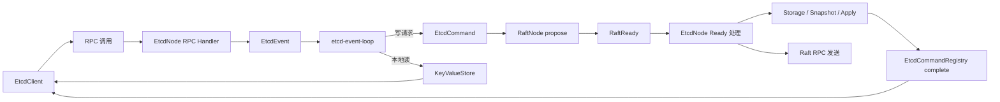

# MVCC KV 骨架联调全链路说明（EtcdClient / RPC / EtcdNode / RaftNode）

## 1. 文档范围

本文描述当前 `etcd-kernel` 的真实联调骨架。当前阶段只验证：

1. `EtcdClient` -> RPC -> `EtcdNode` 的请求入口。
2. `EtcdNode` -> `RaftNode` 的 propose / step / ready / advance 主链路。
3. `RaftNode` -> `EtcdNode` 的持久化、apply、快照和 Raft RPC 发送。
4. `KeyValueStore` 作为当前阶段的临时 MVCC 状态机。
5. 崩溃恢复、快照安装、历史 revision 读取、线性一致读。

不包含未来阶段能力：

- `Txn`
- `Lease`
- `Watch`
- `Compact`
- `HashKv`
- `Status`
- `SDK`
- `Console`

## 2. 组件职责

### 2.1 客户端与响应封装

- `EtcdClient`
  - 对外的最小客户端入口。
  - 负责把 `put/get/delete/range/deleteRange` 请求转换成 RPC 调用。
  - 负责在 `notLeader` 时按 leaderId 进行路由。

- `EtcdRpcResponse<T>` + `EtcdResponseHeader`
  - 统一响应信封。
  - `header` 承载成功、失败、leader 路由等通用元信息。
  - `body` 承载具体业务响应，例如 `PutResponse`、`GetResponse`、`RangeResponse`。

### 2.2 Etcd 层

- `EtcdNode`
  - 当前阶段的 Etcd 协调者。
  - 接收 RPC 请求后先进入 `EtcdEvent`，再由 `etcd-event-loop` 决定是本地读还是进入 Raft。
  - 消费 `RaftReady`，完成持久化、apply、快照和消息发送。

- `EtcdEvent` / `EtcdEventType`
  - JVM 内部事件信封。
  - 只在当前进程内流转，不进入网络和磁盘。

- `EtcdCommand` / `EtcdCommandType`
  - 进入 Raft 日志边界的命令信封。
  - 在进入 Raft 前整体序列化，Raft 层不解析业务语义。

- `EtcdCommandRegistry`
  - 连接 propose 阶段和 apply 阶段。
  - 用 `commandId + logIndex` 唤醒等待线程，避免旧 Leader 重写日志时误唤醒。

- `KeyValueStore`
  - 当前阶段的临时 MVCC KV 状态机。
  - 负责 `Put/Get/Range/Delete/DeleteRange`、revision、历史版本和快照。

### 2.3 Raft 层

- `RaftNode`
  - Raft 协议核心。
  - 只在 `raft-event-loop` 内修改 Raft 状态。
  - 不直接做业务状态机 apply，也不直接访问网络和持久化。

- `RaftReady`
  - Raft 层输出的副作用批次。
  - 包含 `hardStateToPersist`、`snapshotToPersist`、`snapshotToApply`、`messagesToSend`、`committedEntries` 等内容。

- `RaftLogState`
  - 维护快照边界后的日志、截断、冲突匹配和复制边界。

## 3. 主链路总览

## 4. 用户请求路径

### 4.1 写请求：PUT / DELETE / DELETE_RANGE

1. `EtcdClient` 调用对应 RPC 方法。
2. `EtcdNode` 的 RPC handler 只做封装，不直接改状态。
3. `EtcdEvent` 投递到 `etcd-event-loop`。
4. 事件循环创建 `EtcdCommand`，注册等待结果。
5. 命令整体序列化后进入 `RaftNode.submitRaftProposeEvent(...)`。
6. `RaftNode` 在 `raft-event-loop` 中判断当前是否 Leader。
7. 不是 Leader 时返回 `notLeader`，是 Leader 时追加日志并返回 `logIndex`。
8. 日志 committed 后，`RaftNode` 产出 `RaftApplyMessage`。
9. `EtcdNode` 在 apply 阶段真正修改 `KeyValueStore`。
10. `EtcdCommandRegistry.complete(logIndex, commandId, result)` 唤醒 RPC 等待线程。

### 4.2 读请求：GET / RANGE

- `linearizableRead = true` 且 `revision = 0`
  - 进入 Raft。
  - 这样读和写处于同一条提交顺序里，保证线性一致。

- `linearizableRead = false`
  - 直接读取本地 `KeyValueStore`。
  - 不保证跨节点线性一致，但延迟更低。

- `revision > 0`
  - 直接按历史 revision 本地读取。
  - 这是 MVCC 语义，不需要再次进入 Raft。

## 5. Raft RPC 链路

### 5.1 入站

远端节点会调用本节点的：

- `handleRaftRpcRequestVoteRequest`
- `handleRaftRpcRequestVoteResponse`
- `handleRaftRpcAppendEntriesRequest`
- `handleRaftRpcAppendEntriesResponse`
- `handleRaftRpcInstallSnapshotRequest`
- `handleRaftRpcInstallSnapshotResponse`

这些 handler 只负责把消息转给 `RaftNode`，不在 RPC 线程里直接改 Raft 状态。

### 5.2 出站

1. `RaftNode` 产出 `RaftRpcMessage`。
2. `RaftReady.messagesToSend` 携带待发送消息。
3. `EtcdNode` 根据 `targetNodeId` 找到 `NodeEndpoint`。
4. `RpcClient` 发送具体消息。
5. 发送失败采用 best-effort，不阻断当前 Ready 生命周期。

## 6. Ready / Advance 边界

1. `RaftNode` 处理事件后生成待执行副作用。
2. `EtcdNode` 取出一个 `RaftReady`。
3. 先持久化 `HardState / Snapshot / Entries / lastApplied`。
4. 再 apply `snapshotToApply`。
5. 再 apply `committedEntries`。
6. 如需创建快照，则提交快照创建请求。
7. 最后发送 `messagesToSend`。
8. 处理完成后提交 `submitRaftAdvanceEvent(ready)`。

这个边界保证：

- Raft 核心状态推进和上层副作用分离。
- 同一时刻只处理一个未确认 Ready，避免乱序交叉。

## 7. 快照流程

### 7.1 快照触发

`RaftNode` 在累计一定数量的 committed 日志后，触发 `snapshotCreateRequested`。

### 7.2 快照创建

1. `EtcdNode` 调用 `KeyValueStore.createSnapshot()`。
2. 当前状态机深拷贝为 `KeyValueStoreSnapshot`。
3. 序列化后的快照数据交给 `RaftNode`。
4. `RaftNode` 创建 `RaftSnapshot` 并压缩日志边界。

### 7.3 快照安装

1. Leader 发送 `InstallSnapshotRequest`。
2. Follower 的 `RaftNode` 更新日志边界。
3. `EtcdNode` 先持久化快照，再恢复 `KeyValueStore`。
4. 恢复后继续处理快照之后的 committed 日志。

## 8. 崩溃恢复流程

当前阶段只用一个持久化对象：

- group: `raft`
- key: `persistent-state`
- value: `RaftPersistentState`

其中包含：

- `hardState`
- `snapshot`
- `entries`
- `lastAppliedRaftLogIndex`

启动恢复时按以下顺序执行：

1. 读取并反序列化 `RaftPersistentState`。
2. 恢复 `RaftNode` 的 hardState、snapshot 和日志。
3. 用快照恢复 `KeyValueStore`。
4. 重放 `lastAppliedRaftLogIndex` 之后仍未 apply 的日志。
5. 最后再启动 Raft event-loop 和 etcd-event-loop。

这样可以保证：

- 任期和投票信息连续。
- 快照边界和日志边界一致。
- 状态机恢复到崩溃前已 apply 的位置。

## 9. Apply 与结果回传

1. `RaftNode` 输出 `RaftApplyMessage(logIndex, commandData)`。
2. `EtcdNode` 解码为 `EtcdCommand`。
3. 先推进并持久化 `lastAppliedRaftLogIndex`。
4. 再把命令真正作用到 `KeyValueStore`。
5. 最后通过 `EtcdCommandRegistry.complete(...)` 回填结果。

这里必须使用 `logIndex + commandId`：

- 防止旧 Leader 未提交日志被新 Leader 覆盖后误唤醒。
- 保证结果回传和 Raft 提交顺序严格一致。

## 10. 当前阶段结论

当前实现已经形成一个足够精简的骨架：

1. 客户端请求能贯通到 Raft，并在 apply 后返回。
2. Raft RPC 请求、响应和快照链路都有独立入口。
3. Ready / Advance 边界清晰，没有把业务逻辑散落到多个线程里。
4. `KeyValueStore` 已经提供 MVCC 核心验证能力。
5. 代码结构可以作为后续 `Txn`、`Lease`、`Watch`、`Compact` 的稳定起点。